# 1、小数位数的保留

```c++
#include<iomanip>

cout  << fixed << setprecision(小数位数) << 目标 <<endl;
```


# 2、取大、取小函数

```c++
#include <algorithm>

max{a,b}

min{a,b}
```


**用于计算“剩余部分”**

如：

```
int a=max(0,min(x2,x4)-max(x1,x3));
```


# 3、浮点数精度问题

将等于 0 改成绝对值小于 1e-9

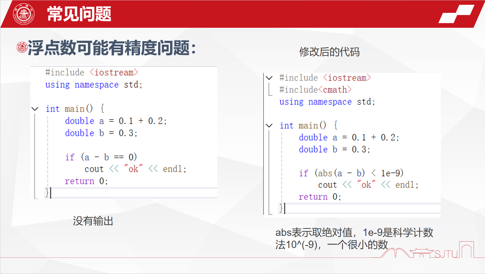

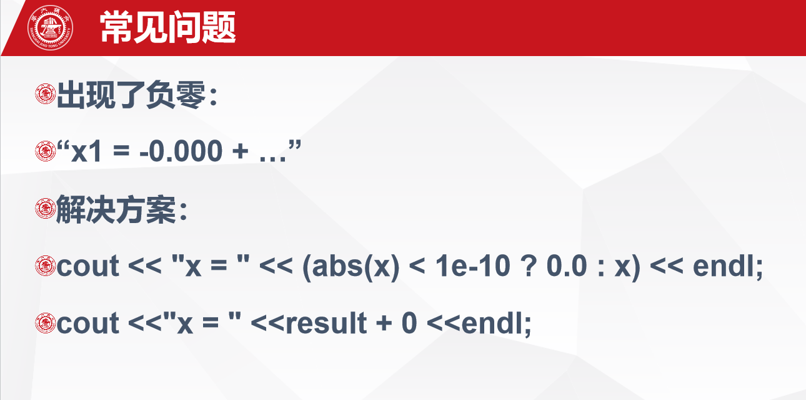

# 4、除法、取模运算符的使用

%：取模，**留下位数之后的内容**，可用于 **提取** 个位等

1234%10 = 4


/：除以，会直接截取出整数，**留下位数之前的内容**，可用于 **去除** 个位等

1234/10 = 123

# 5、尽量做到见名知意！

如 maxcount、max、count、currentnum 这种的！

# 6、负数的取模运算

规则：结果符号始终与 **被除数** 一致！与除数无关！这和数学里面的是相反的！但是更加符合常理！

如

-153%10 =-3

153%（-10）= 3

# 7、变量的作用域

变量只在它被定义的代码块（用{ }包裹的区域）内有效，出了这个区域就会消失，而不影响外部的同名变量


若外部定义了一个变量 a，内部又定义了变量 a，则在{ }内以内部的 a 为准，在{ }外以外部的 a 为准

# 8、“表达式必须是可修改的左值”报错原因

是因为你用于比较的等号“==”写成了赋值”=”

# 9、计算日期是这一年的第几天的公式（不列举月份方法）

 **计算 dayNum 为该年的第几天：**

1）dayNum = 31*(month-1)+day

*2）二月以后的日期需要减去(4* month+23)/10

3）如果是闰年则二月以后的日期需要再加 1

# 10、得知用户输入了多少个数据的方法

提示：一行红包输入结束的标志可以是回车'\n'或特殊的 EoF 字符。

特别地，以下代码当 cin >> a 碰到 EoF 字符时会退出循环，而行尾'\n'字符需要主动检查：

```c++
int hongbao[1000]//创建一个足够大的数组
int a,count=0;
while (cin >> a) {//输入一个整型数据a
        hongbao[count] = a;
        count++;
        //则用户输入的数据数为count的值
        
        if (cin.get() == '\n') {
            break;
            }
        }
```

# 11、写 else if 的好习惯！

​	不要老用多个 if，用 else if 来写，这样能够保证你的 else 表示的是是所有情况之外的情况，而不仅仅是最后这个 if 之外的情况！错过多次了！

标准语句结构应该是：if、else if、else

```c++
#include<iostream>
using namespace std;

int main()
{
char ch[100];
cin.getline(ch,100);//数组型字符串，有一个\0在末尾！
int num=0,space=0,letter=0,other=0;
for(int i=0;i<100;i++){
    if(ch[i]>='1'&&ch[i]<='9')num++;
    else if(ch[i]==' ')space++;
    else if(ch[i]>='A'&&ch[i]<='Z'||ch[i]>='a'&&ch[i]<='z')letter++;
    else if(ch[i]=='\0')break;
    else other++;

}
cout<<"数字："<<num<<endl;
cout<<"空格："<<space<<endl;
cout<<"字母："<<letter<<endl;
cout<<"其他字符："<<other<<endl;

	return 0;
}

```

若写成

```c++
for(int i=0;i<100;i++){
    if(ch[i]>='1'&&ch[i]<='9')num++;
    if(ch[i]==' ')space++;
    if(ch[i]>='A'&&ch[i]<='Z'||ch[i]>='a'&&ch[i]<='z')letter++;
    if(ch[i]=='\0')break;
    else other++;//这个else就会是：只要不是\0就记一次other，这就错了！
}
```

# 12、寻找最大最小值时的更新思想

设置两个变量，一个是 max_count，一个是 current_count

现在处理的是 current_count，满足条件时 current_count++，反之则 current_count 清零等

每当 current_++之后，与 max_count 比较，更新 max_count

如 **例题 9**


# 13、自动类型转换规则

C++ 对基础类型（如整数、浮点数）定义了明确的转换优先级，遵循 “低精度 → 高精度” 的安全转换原则，具体规则如下：

1. **整数提升**：
   - 小整数类型（`bool`、`char`、`short`）自动转换为 `int`（若 `int` 能表示其所有值）或 `unsigned int`。
   - 例如：`char c = 'a'; int i = c;`（`char` 提升为 `int`）。
2. **混合类型运算**：
   - “低精度 → 高精度”
   - 示例：`3 + 4.5` 中，`3`（`int`）会转换为 `3.0`（`double`），结果为 `7.5`。
3. **赋值转换**：
   - 右侧值转换为左侧变量的类型，可能导致精度丢失或溢出（编译器可能警告）。
   - 示例：`int x = 3.14;`（`double` → `int`，结果为 `3`，小数部分截断）。

# 14、字符串的输入方式

- cin.get：可直接读单个字符，多字符需指定缓冲区，**不自动丢弃换行符**（需用 cin.ignore 清理）；

- cin.getline：专为 **行读取** 设计，**自动跳过换行符**，更适合读取完整输入行。

  ```c++
  #include <iostream>
  using namespace std;
  
  int main() {
      // 1. cin.get 读单个字符
      char ch1, ch2;
      cout << "输入两个字符（中间无空格）：";
      ch1 = cin.get();  // 读第一个字符
      ch2 = cin.get();  // 读第二个字符（包括空格/换行）
      cout << "cin.get 读取结果：" << ch1 << " 和 " << ch2 << endl;
  
      // 清空输入缓冲区的残留换行（避免影响后续读取）
      cin.ignore();
  
      // 2. cin.get 读多个字符（指定缓冲区大小）
      char buf[20];
      cout << "\n输入一段文字（不超过18个字符）：";
      cin.get(buf, 20);  // 最多读19个字符（留1个存字符串结束符'\0'）
      cout << "cin.get 多字符读取结果：" << buf << endl;
  
      cin.ignore();  // 清空缓冲区
  
      // 3. cin.getline 按行读取
      char line[30];
      cout << "\n输入一行文字：";
      cin.getline(line, 30);  // 整行读取，自动忽略末尾换行符
      cout << "cin.getline 读取结果：" << line << endl;
  
      return 0;
  }
  ```

  
  
# 15、头文件 cctype 的使用
  
  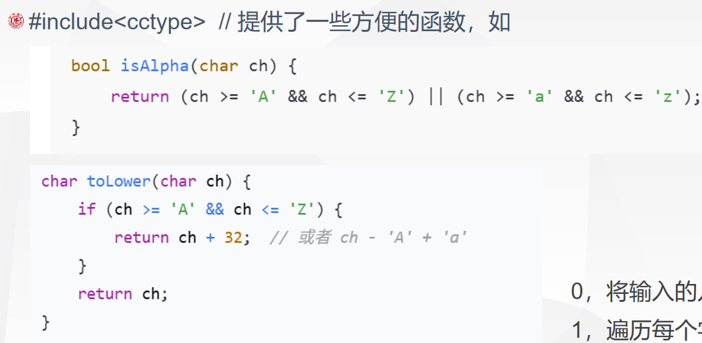
  
  # 16、不确定行数的输入
  
  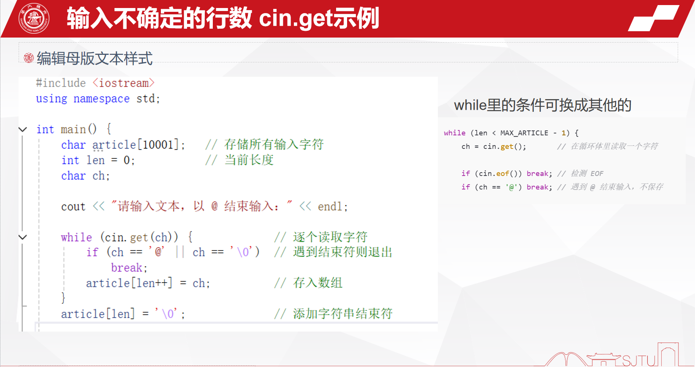 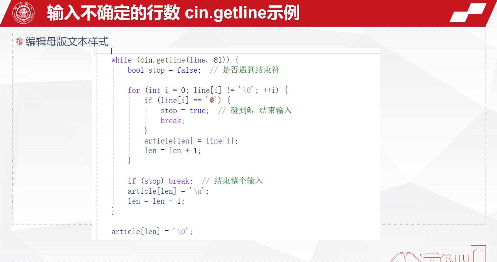
  
  while(cin.get(ch){   }表示逐个读取字符进入 ch 这个变量当中，你要自己加入“遇到结束符则退出”的代码！
  
  # 17、学会画图找规律，而不是直接写代码！
  
  **写伪代码、画图找规律** 能够帮助你完成任务！没有人可以直接写出来！
  
  如：例题 13 的分析过程
  
  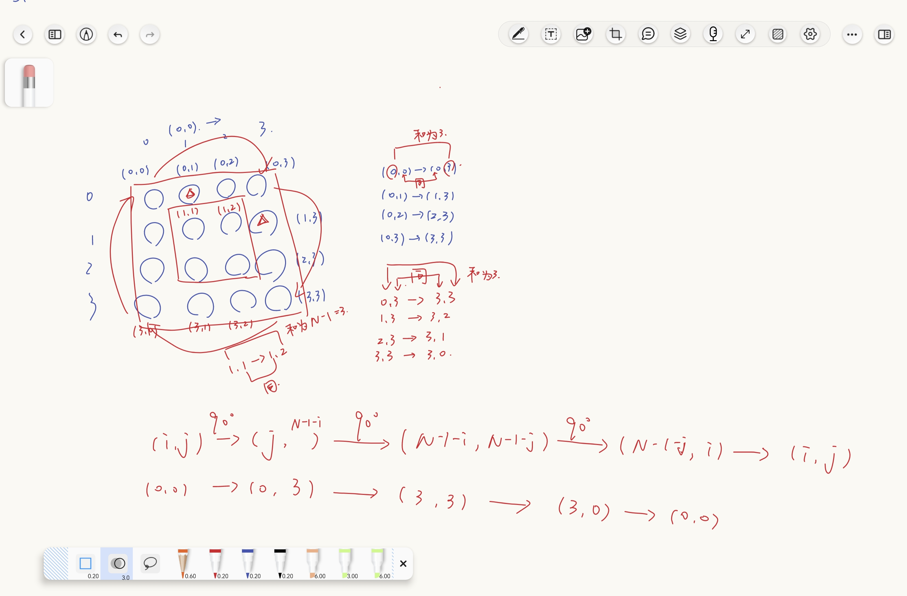
  
  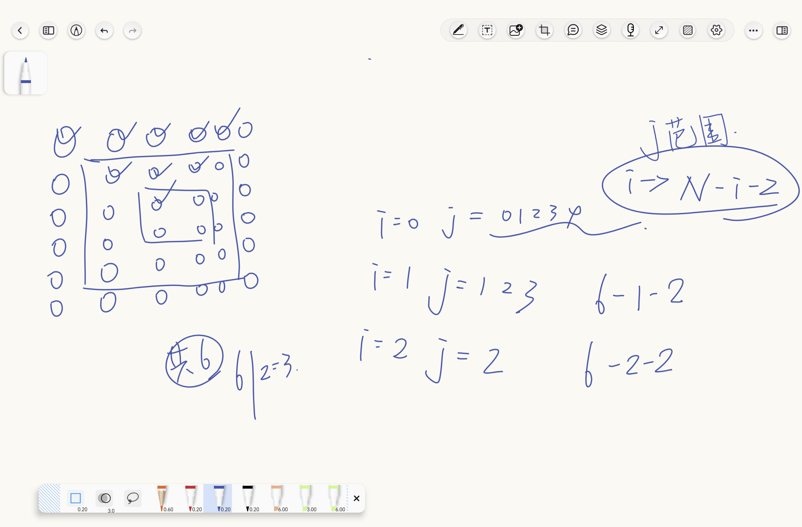
  
  又如例 17 潜水最优策略问题 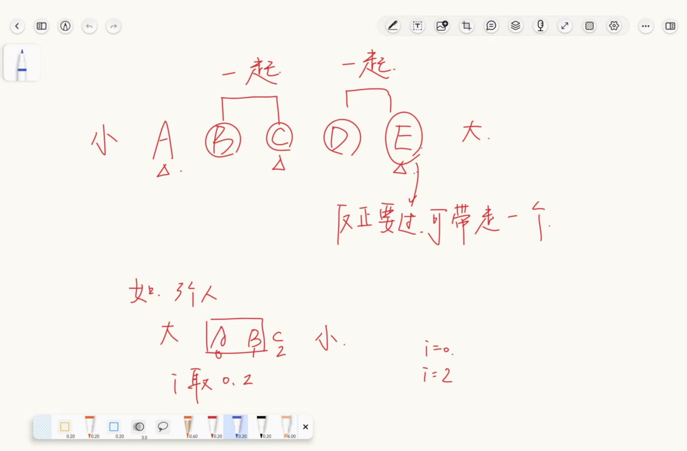
  
  # 18、if/else 语句的连续性
  
  if、else if、else 必须连着写！保证连续性！否则就会报错！如下面这个
  
  ```c++
  long long kuaisumi(int a, int n) {
      if (n == 0) return 1;
      a %= mod;//分隔开了if和else if，所以报错！！！
      else if (n % 2 == 1) {
          long long temp = kuaisumi(a, (n - 1) / 2);
          return ((temp * temp) % mod) * a % mod;
      }
  
      else if (n % 2 == 0) {
          long long temp = kuaisumi(a, n / 2);
          return (temp * temp) % mod;
      }
  
  }
  ```
  
  应该把 a%= mod; 提前到 if 之前，则不会报错了，关键是要把 if 和 else if 放在一起！
  
  # 19、递归函数之中，尽量避免二次调用！
  
  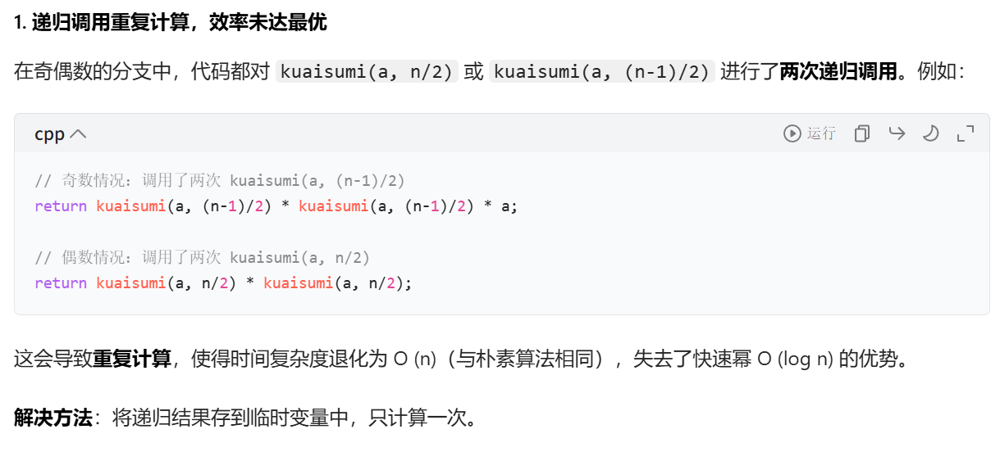

# 20、解决数据溢出的几个办法

1.使用 long long 型变量

2.对于最后要取模的，应该在每一步计算完后立即取模（运用模的运算性质），而不是最后取模，因为操作过程中会溢出！

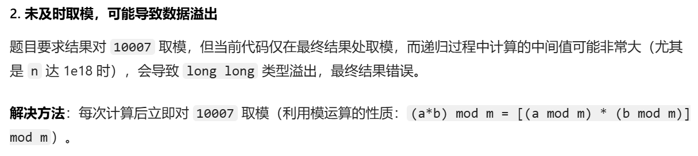

# 21、递归函数的本质: 马尔科夫链

递归函数，其实就是高中数学的马尔科夫链，注意先在数学上找到递推关系，再来编程！

如例题 14

# 22、统计 n 的阶乘中因子 5 的个数的方法

其实是把这个数 n 循环除以 5 直到为 0，得到的数就是 5 因子的个数

如例题 15

# 23、时刻记得 C++中的乘法是舍弃小数的！

我的一个疑惑：下面这个函数是否是一个死循环呢？

```c++
int countFactorialZero(int n) {
    int count = 0;
    while (n > 0) {
        n = n / 5;  // 每次除以5，统计当前层含因子5的数的个数
        count += n; // 累加当前层的个数
    }
    return count;
}
```

我认为 n 永远不会降到 0，只会无限趋近于 0，这在 C++中是不对的！因为 C++会直接舍弃小数部分！

故这个 n > 0 和 n >= 1 是一样的！！！

`n = n / 5`：这里是 **整数除法**（C++ 中 `int` 除以 `int` 会舍弃小数部分，只保留整数商）

# 24、一定要学会使用哨兵循环！

很多时候无从下手，是因为我不会用 while 循环！

如实现文章里面每个单词的反转（例题 16），使用

```c++
int start=i;
while(str[i]!=' '&&str[i]!='\0'){//i最后停在' '处或'\0'处
     i++;
}
int end=i-1;
```

可以实现标记目前正在处理的单词的首下标和尾下标，还可以把 **i ** 放到这个单词之后，方便进入下一个单词！


我写哨兵循环有一个易错点，即忘记在最后进行 **i++、start++, end--、left++, right--** 操作，写多了 for 循环的后遗症，一定要注意！出现过多次死循环了！！！


其次哨兵循环的关键点在于如 **while(start < end)、while(left < right) ** 条件，是你这个哨兵循环能不能正常运行的关键！！！很多时候我就卡在这个条件转不过来，不知道如何停下来！

**经典题目例 16，哨兵循环的用法，可以反复回味！**

# 25、注意变量的定义时机！

变量是有各自的作用域的，如果你有变量需要最后输出，即带出搜索过程，一定要在循环之外定义！

下面这段是我写的错误代码：

```c++
    int i = 1;
    while (i < n) {//选取买入的时间
        int max_profit = 0;//这个是最后要带出去的！不该在这里
        int current_profit = 0;
        int start, end;//这个是最后要带出去的！不该在这里

        for (int j = i + 1; j <= n; j++) {//选取卖出的时间
            if (arr[j] > arr[i]) {
                current_profit = arr[j] - arr[i];
                if (current_profit > max_profit) {
                    start = i;
                    end = j;
                    max_profit = current_profit;
                }
            }
        }

	i++；//选择下一个买入时间

    }
    if (max_profit == 0)cout << '0' << endl;
    else cout << start << end << max_profit << endl;
```

正确的应该是：

```c++
    int i=1;
    int max_profit=0;
    int start,end;
    while(i<n){//选取买入的时间
    int current_profit=0;

        for(int j=i+1;j<=n;j++){//选取卖出的时间
            if(arr[j]>arr[i]){
                current_profit=arr[j]-arr[i];
                if(current_profit>max_profit){
                    start=i;
                    end=j;
                    max_profit=current_profit;
             }
            }
        }

    i++;

    }
    if (max_profit == 0)cout << '0' << endl;
    else cout << start << end << max_profit << endl;
```

# 26、递归函数一定要加上终止条件！

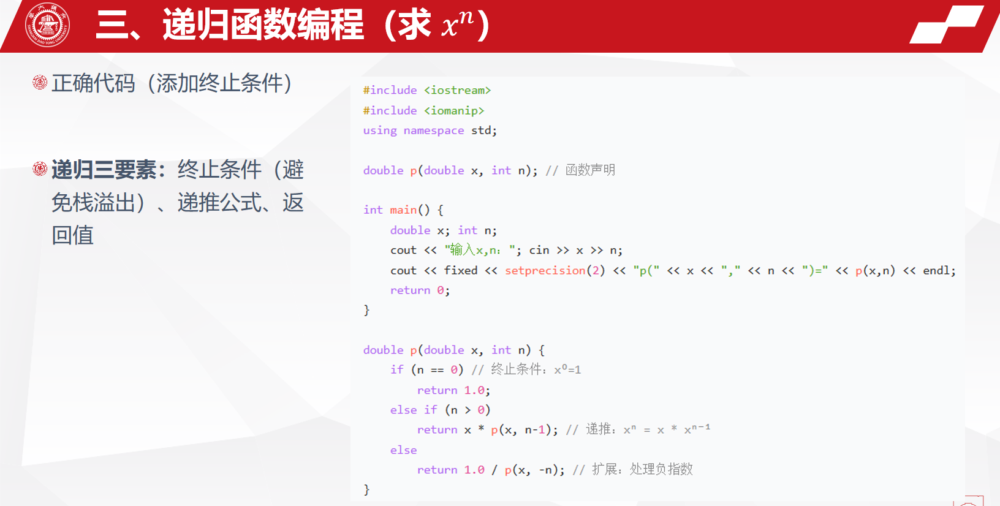

# 27、数组名退化为指针


**<span style="font-size:1.6em; font-weight:bold; font-style:italic;">可理解为：<span style="text-decoration:underline;">数组名就是指针</span>，只有 3 种情况下会表示整个数组！</span>**


### 一、数组名不退化（代表整个数组）

**仅 3 种核心场景**，记准即可：

1. 作为 `sizeof` 操作数（`sizeof(arr)` 计算整个数组字节数）；
2. 作为 `&` 取地址操作数（`&arr` 得到数组指针 `T(*)[N]`）；
3. 字符串字面量直接初始化数组（如 `char str[] = "abc"`）。


### 二、数组名退化（变为指向首元素的指针）

**除 “不退化场景” 外，数组名在多数使用场景中都会退化**，比如：

- 赋值运算（如 `int *p = arr`，`arr` 退化）；
- 函数参数传递（如 `void func(int arr[])`，形参 `arr` 实际是 `int*`）；
- 数组元素访问（如 `arr[2]` 等价于 `*(arr+2)`，依赖退化）；
- 参与指针运算（如 `arr++`、`arr+1`，需退化后进行）。

​	故而有这个例子：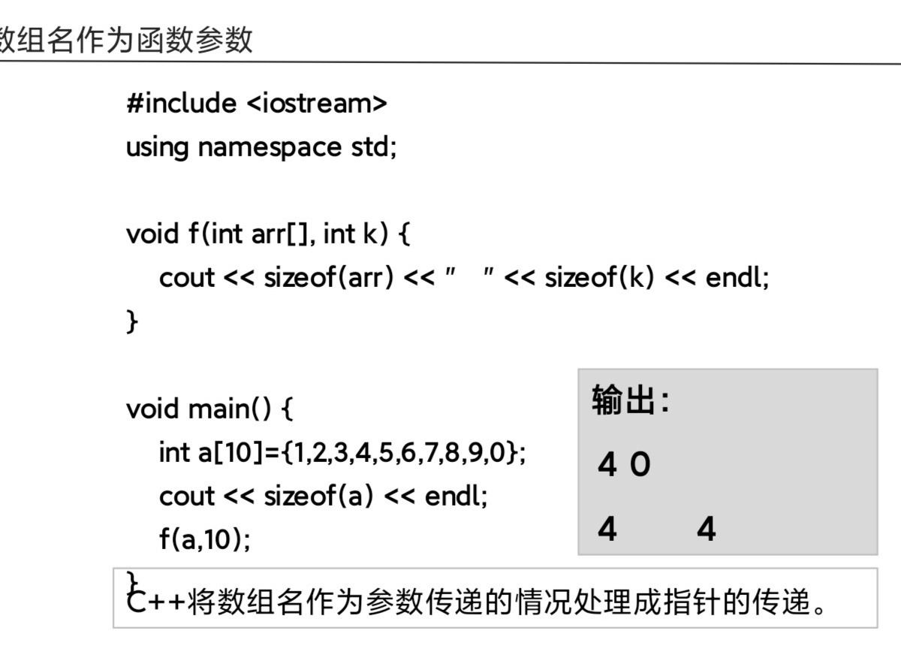

1. **形参的本质是指针**

   函数形参中写 `int arr[]`/`int arr[10]`，本质都是 `int* arr`（指向 `int` 的指针），数组长度 `10` 只是 “形式上的提示”，实际无效。

2. **实参的退化**

   调用函数时，数组名 `a` 会 **退化为指针（指向数组首元素的地址）**，传递的是 **“地址值”**，而非整个数组的拷贝。

3. **`sizeof` 的差异**

   - 传参前（数组定义的作用域）：`sizeof(数组名)` = **整个数组** 的字节大小（如 `int a[10]` → `40`）。
   - 传参后（函数内部）：`sizeof(形参名)` = **指针** 的字节大小（如 32 位系统 → `4`）。

4. **无法直接获取数组长度**

   函数内部无法通过 `sizeof(arr)/sizeof(arr[0])` 计算原数组长度（因为 `arr` 是指针），必须额外传 “数组长度” 参数。


​	借此也可以理解，为什么分治法求数组最大值和最小值时，可以通过在传入数组的位置写 a 表示从 a [0] 开始，写 a+n/2 表示从 a [n/2] 开始！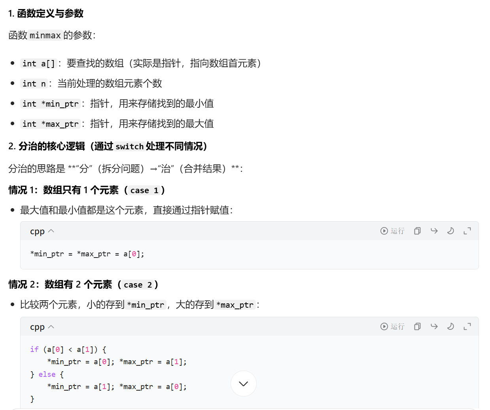

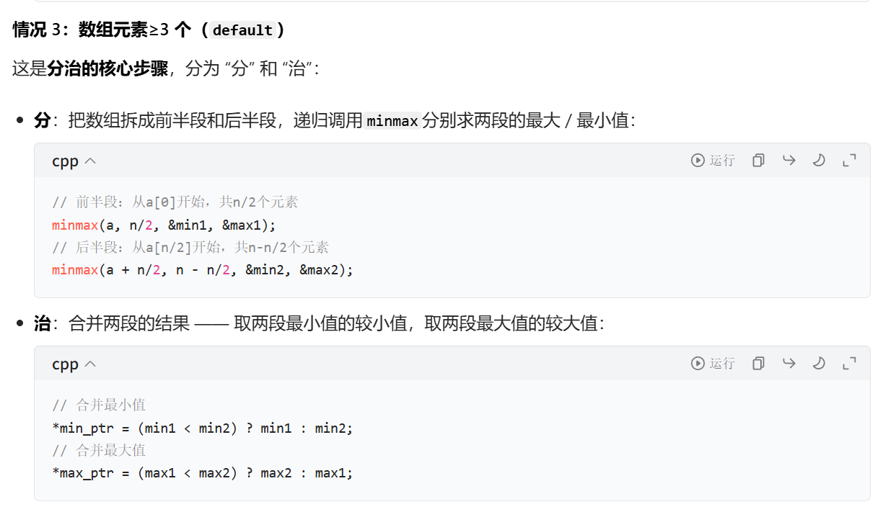

# 28、统计数组元素个数

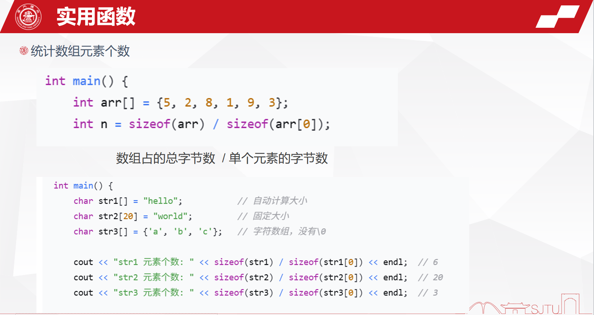

# 29、常用的函数

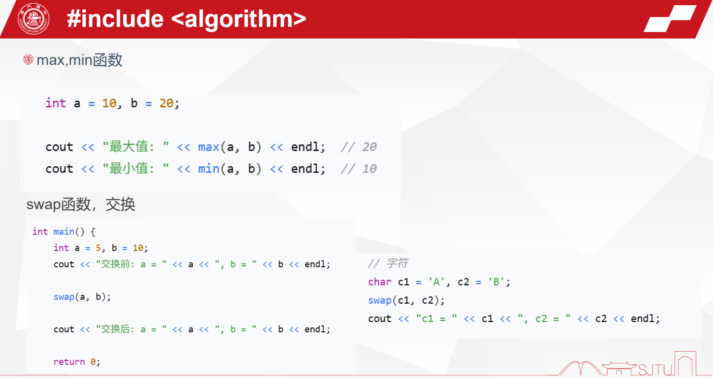

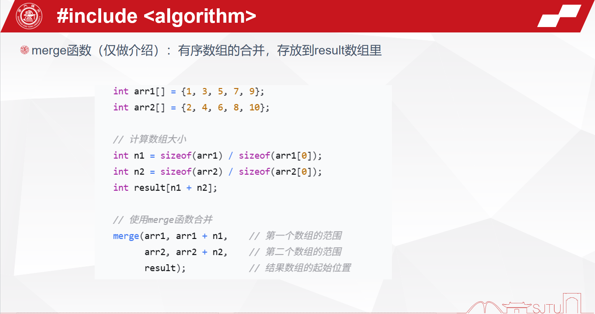

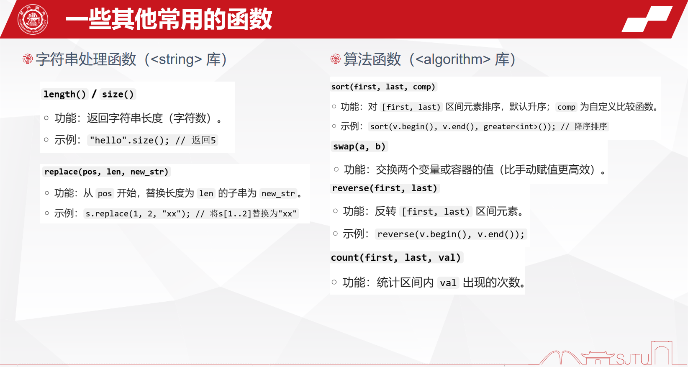

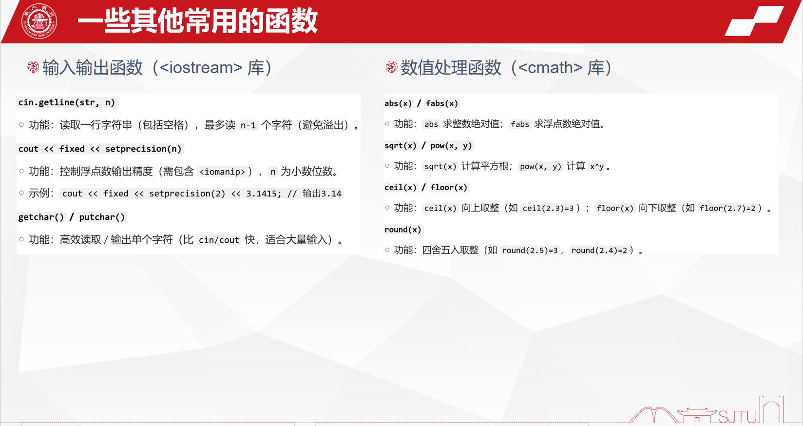

**cctype 库中的一些方便函数**
	islower(int)用于测试字符是否是小写字母，如果是返回 1，否则返回 0；
	isupper(int)用于测试字符是否是大写字母，如果是返回 1，否则返回 0；
	isdigit(int)用于测试字符是否是 0~9，如果是返回 1，否则返回 0
比如：
islower('a') 结果为 1
islower('A') 结果为 0


**cstring 库中的一些方便函数**

​	strlen(arr)用于得到字符串的有效长度


# 30、函数声明时，允许不写变量名，只写类型

例如：

```c++
int func(char,int,int);
```

# 31、返回函数内部变量的注意事项

​	直接返回局部变量的 **值** 是可以的（会拷贝副本）

​	但如果想让局部变量 “持续存在” 后被使用，不能直接返回它的引用 / 指针（因为局部变量在函数结束后会销毁）


​	**故而要想返回一个函数内部的变量，可以直接返回局部变量，也可以返回一个堆内存中的地址**


# 32、返回引用类型

​	在 C++ 中，**返回引用类型的函数** 是指函数的返回值是某个变量的 “引用（别名）”，它的核心特点是 **不拷贝数据，直接传递变量的地址（但语法上表现为值的形式）**


**核心特性**

1. **不拷贝数据，效率高**

   返回引用时，不会像 “返回普通值” 那样拷贝变量内容，而是直接传递变量的地址，适合大型对象（比如结构体、类对象）的返回。

2. **返回的变量必须 “存活”**

   不能返回 **局部变量的引用**（局部变量在函数结束后会销毁，引用会变成 “悬空引用”）。

   ✅ 可以返回：

   - 全局变量 / 静态局部变量（生命周期长）
   - **堆内存中的变量（用 `new` 分配的，手动释放前一直存在！不会随函数结束而销毁，动态内存魅力时刻！）**
   - 实参的引用（别名）

例如：

```cpp
// 返回结构体引用的函数（堆内存分配）
Student &getStudent() {
    // new分配在堆内存，它不会随函数结束销毁！
    Student *stu = new Student;
    stu->id = 1001;
    stu->name = "张三";
    return *stu; // 返回指针解引用后的对象（引用）
}
```


​	**关键：返回引用类型的函数，一定要用一个引用的变量（此处为 s1）来接收，之后用这个 s1 就和用正常的变量是一样的！但这个 s1 实际上是一个隐式的指针，指向的是被它取别名的地方（此处为堆内存中的 student）**

- 在堆内存中创建 `studentT` 类型的结构体，返回其引用（本质是传递堆内存地址）。
- 关键特性：
  - 用 `new` 分配堆内存，避免了局部变量（栈内存）销毁导致的 “悬空引用” 问题；
  - 返回的 `*student` 是指针解引用后的结构体对象，函数声明的 `&` 使其以 “引用” 形式返回。

## <span style="font-size:0.8em;">核心说明的解读</span>

- **“本质上返回的是结构体的地址”**：引用的底层是地址传递，所以该函数实际传递的是堆中结构体的内存地址；
- **“函数中返回的结构体不能是局部变量”**：局部变量存储在栈内存，函数执行结束后会被销毁，返回其引用会导致 “悬空引用”（访问无效内存），**因此必须用堆内存（`new`）或全局 / 静态变量**


​	问：此程序中也可以直接返回一个局部变量，在外面用一个正常的变量接收，而不使用引用类型的变量，那这里为什么要用引用的方式实现呢？

​	**第一**，如果 `studentT` 是一个「大型结构体」（比如包含 `int scores[100]`（成绩数组）、`char address[256]`（地址）等成员）：

- 若返回局部变量拷贝：函数会把这些成员的所有数据「复制一份」传给外面的变量，数据越多，拷贝耗时越长、占用内存越多 **（比如拷贝 1000 个这样的结构体，开销会很明显）**；
- 若返回引用：不管结构体多大，本质只传递「一个内存地址」（通常 8 字节，和平台无关），**几乎没有拷贝开销**，效率大幅提升。

​	哪怕 `studentT` 现在很小，用引用也是「预留扩展性」—— 后续结构体变大后，不用修改函数返回逻辑，效率依然较高。


​	**第二**，相比返回指针，代码中用「返回引用」而不是「返回指针」，还有个实用原因：

- 若返回指针：外面接收后要 ⽤ `s->成员名` 访问（比如 `s->score`），语法稍繁琐，还可能出现空指针风险；
- 若返回引用：外面接收后直接用 `s.成员名` 访问（和普通变量一样），语法更简洁，且引用不能为 `NULL`（更安全）。

本质上，引用是「用值的语法，实现地址的传递」，兼顾了「效率（地址传递）」和「易用性（值语法）」。

# 33、阶乘计算的小坑

注意阶乘的增长极快，若用 int 类型，很可能出现越界，故 **应该使用 long long 类型**！！！

如例 21

# 34、字符串的输入和输出很方便，无需 for 循环

如果定义了一个 **字符数组** 如 char ch [100]

**输入 ch**：可以直接用 cin >> ch; 输入会在遇到空白字符的时候停止，并补充\0

（如果想要输入整行，则使用 cin.get 或者 cin.getline）


**输出 ch**：可以直接用 cout << ch; 输出会在遇到\0 的时候停止


注：但是其他类型如 int 型的数组，不可以这样输出，如直接 cout << arr << endl; 输出的是 arr 的首地址！因为 arr 是一个指针

注：cin.getline 的用法如下示例

```c++
int arr[size];
cin.getline(arr,size);
```

详细解释：

1. **`nums` 的类型是什么？**

   在你的代码中，`nums` 是一个 `char` 类型的数组：`char nums[10];`。

   在 C++ 中，当你将一个数组名传递给一个函数（比如 `cout <<`）时，数组名会 **隐式地转换** 为一个指向数组首元素的指针。

   所以，**`nums` 的类型在这里实际上等同于 `char*`（一个指向字符的指针）**。

2. **`cout` 如何处理 `char*`？**

   C++ 的 `cout` 被设计得非常智能。当它遇到一个 `char*` 类型的参数时，它不会像对待其他指针（比如 `int*`）那样输出这个指针的内存地址。相反，它会把这个 `char*` **当作一个字符串的起始地址** 来处理。

3. **`cout` 的工作流程**

   - `cout` 接收到 `nums`（它的值是数组第一个字符的内存地址）。
   - 它从这个地址开始，逐个读取内存中的字符并输出到屏幕上。
   - 它会一直读下去，直到它读到一个非常特殊的字符：**空字符（Null Character）**，其 ASCII 码为 0，在 C++ 中用 `'\0'` 表示。
   - 当 `cout` 遇到 `'\0'` 时，它就知道这是字符串的结尾了，于是停止输出。


**注意！这样输出字符串的时候，一定要保证你的数组最后是有\0 的，不然会一直输出下去！如例题 23 手动添加\0，同时在申请动态内存的时候也要注意多一位空间留给\0**

**而 cin.getline 会自动在行末尾加上\0 结束符**

**若用 cin.get 逐个字符读取则不会，要手动在末尾加上\0 结束符，方便后续编程！**


# 35、字符串的遍历方法优化，无需用 for 循环

其实很简单，用 while 循环就可以，无需事先得知字符串的长度！

核心是抓住字符串末尾自动添加一个\0

如下面的例子

```c++
char arr[50];
cin>>arr;
int i=0;
while(arr[i]!='\0'){
	//要执行的命令
	i++;
}
```

# 36、求权值，并借助权值遍历每一位数字

如例 25，关键是求出权值之后，提取每一次的最高位处理，并且每一轮结束之后 count/= 10

关键还在于去除已经处理过的最高位数字，善于运用除号/和取模%，规则查阅笔记第 4 点

# 37、学会在输入的时候就处理数据！

如例 26，学会用：

```c++
char c;
while (cin.get(c) && c != '\n'){
//操作的代码，如检验c是字符还是数字等，从而决定c是存入数组，还是直接去除，又或者其他操作，很方便！
}
```

cin.get 示例：

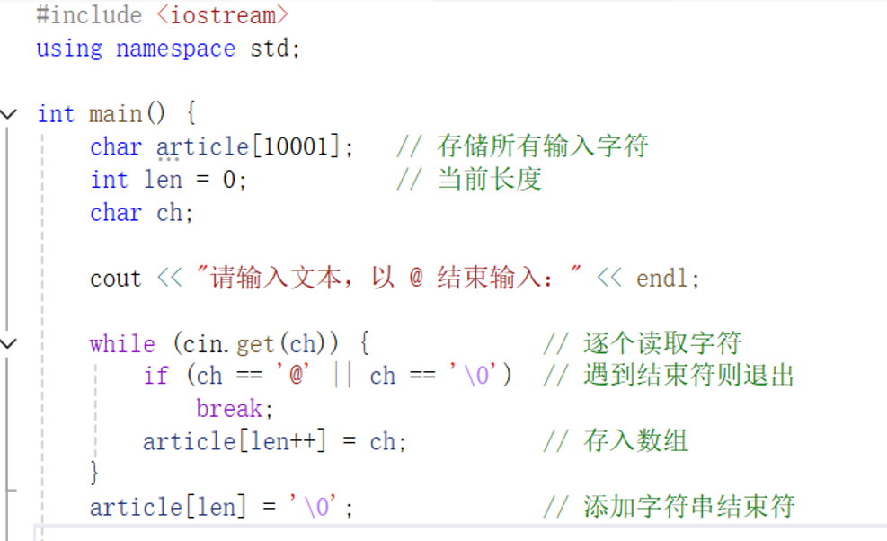

cin.getline 示例：

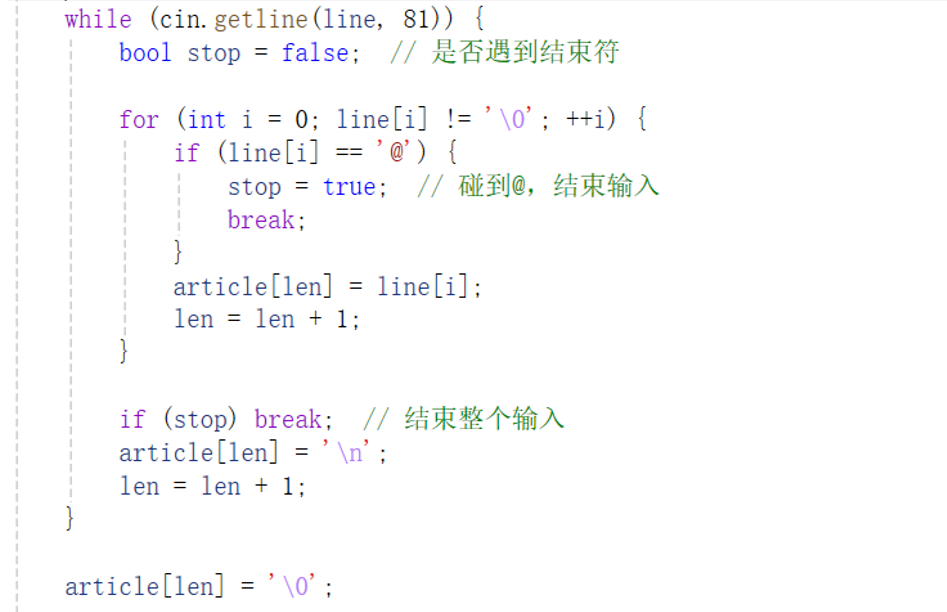

# 38、动态规划算法

如例题 27，实际上和高中的多方程马尔科夫链是一样的，先分类，再列出不同类之间的递推关系

动态规划（Dynamic Programming，DP）是一种 **解决复杂问题的通用算法思想**，核心是：**将原问题拆解为若干个 “重叠的子问题”，通过求解子问题并复用结果，最终得到原问题的解**。它不直接攻击原问题，而是先解决更简单的子问题，再逐步构建出原问题的答案。

### 核心思想

动态规划的有效性依赖于两个关键性质：

1. **重叠子问题 (Overlapping Subproblems)**
   - 原问题可以分解为 smaller 的子问题。
   - 这些子问题在求解过程中会被 **重复计算** 多次。
   - 动态规划通过 **存储** 这些子问题的解（通常在一个数组或哈希表中），避免了重复计算，从而提高效率。
2. **最优子结构 (Optimal Substructure)**
   - 原问题的 **最优解** 包含了其子问题的 **最优解**。
   - 这意味着，我们可以通过组合子问题的最优解来构造出原问题的最优解。
   - 这是动态规划能够工作的 **数学基础**。

你可以把动态规划想象成一个 **记忆化的过程**。就像你在做一道复杂的数学题时，会先计算出几个关键的中间结果，并把它们记下来，后面的步骤直接使用这些结果，而不是重新计算。

------

### 动态规划解题的一般步骤

虽然具体问题千差万别，但动态规划的解题思路和步骤具有高度的通用性。通常可以分为以下五步：

#### 步骤 1：定义状态 (Define State)

这是最 **关键** 也最 **困难** 的一步。你需要定义一个 **状态变量**（例如 `dp[i]` 或 `dp[i][j]`），并明确它 **代表什么含义**。

- **状态的含义**：状态应该能描述问题的一个子问题。它通常包含问题的关键参数。

- 维度

  ：

  - **一维 DP**：`dp[i]`，通常表示 “前 `i` 个元素” 或 “以第 `i` 个元素结尾” 的子问题的解。例如，`dp[i]` 可以是 “前 `i` 个斐波那契数的值”。
  - **二维 DP**：`dp[i][j]`，通常表示 “从第 `i` 个元素到第 `j` 个元素” 的子问题的解。例如，在我们的回文子序列问题中，`dp[i][j]` 表示 “`s[i..j]` 区间内的回文子序列个数”。

- **目标**：你的最终目标是求出 `dp[...]` 在某个特定参数下的值，这个值就是原问题的解。例如，`dp[n]` 或 `dp[0][n-1]`。

**示例（回文子序列问题）**：

- 状态定义：`dp[i][j]` = 字符串 `s` 从索引 `i` 到 `j` 的子串 `s[i..j]` 中包含的回文子序列的个数。
- 目标：`dp[0][n-1]`。

#### 步骤 2：寻找状态转移方程 (Find Transition)

这是动态规划的 **核心逻辑**。你需要找到一个关系式，描述 **如何从更小的子问题的解，推导出当前子问题的解**。

- 思考：`dp[i][j]` 如何由 `dp[i+1][j]`, `dp[i][j-1]`, `dp[i+1][j-1]` 等已经解决的子问题得到？
- 这通常需要对问题进行归纳分析，找到递推关系。
- 转移方程可能会包含 `if-else` 条件判断，以处理不同的情况。

**示例（回文子序列问题）**：

- 状态转移方程：
  - 如果 `s[i] == s[j]`，那么 `dp[i][j] = dp[i+1][j] + dp[i][j-1] + 1`。
  - 如果 `s[i] != s[j]`，那么 `dp[i][j] = dp[i+1][j] + dp[i][j-1] - dp[i+1][j-1]`。

#### 步骤 3：确定初始条件 (Base Case)

状态转移方程是一个递归的过程，它必须有一个 **起点**，否则会无限递归下去。初始条件就是那些 **不需要再分解** 的、最小的子问题的解。

- 这些子问题的解通常是显而易见的。
- 它们是 DP 表的 “种子” 值。

**示例（回文子序列问题）**：

- 初始条件：当子串长度为 1 时（即 `i == j`），`dp[i][i] = 1`。因为单个字符本身就是一个回文子序列。

#### 步骤 4：确定遍历顺序 (Order of Traversal)

在编写代码时，你需要填充一个 DP 表（数组）。遍历顺序至关重要，它必须保证：**当你计算 `dp[i][j]` 时，所有它所依赖的子问题（如 `dp[i+1][j]`）都已经被计算出来了**。

- 对于一维 DP (`dp[i]`)，通常是从前往后遍历 `i`。
- 对于二维 DP (`dp[i][j]`)，遍历顺序比较灵活，但必须遵循依赖关系。
  - 在我们的问题中，`dp[i][j]` 依赖于 **更短的** 子串，所以我们选择 **按子串长度 `len` 从小到大** 遍历。
  - 另一种常见的顺序是 **逆序遍历**，例如在解决 “最长递增子序列” 问题时，我们从数组末尾开始向前计算。

**示例（回文子序列问题）**：

- 遍历顺序：外层循环控制子串长度 `len` 从 `2` 到 `n`，内层循环遍历所有起始元素 `i`。

#### 步骤 5：计算并输出结果 (Compute Result)

按照确定的遍历顺序，根据状态转移方程和初始条件，一步步填充 DP 表。

- 这通常是最直接的一步，只需要将前面的逻辑转化为代码。
- 最终，DP 表中对应目标状态的值就是问题的答案。

**示例（回文子序列问题）**：

- 按照 `len` 和 `i` 的顺序填充 `dp` 二维数组。
- 输出 `dp[0][n-1]`。

------

### 动态规划的常见类型

动态规划可以解决多种类型的问题，常见的有：

1. **线性 DP**：状态是一维的，如斐波那契数列、最长递增子序列 (LIS)。
2. **区间 DP**：状态是二维的，通常表示一个区间 `[i, j]`，如我们刚刚学的回文子序列问题、矩阵链乘法。
3. **背包问题**：这是一大类经典问题，包括 0-1 背包、完全背包、多重背包等。状态通常是 `dp[i][w]` 表示 “考虑前 `i` 个物品，放入容量为 `w` 的背包的最大价值”。
4. **路径 DP**：通常在网格或图上进行，状态表示到达某个位置的路径数或最小代价，如机器人路径问题。
5. **状态压缩 DP**：当状态空间很大时，使用位运算等技巧来压缩状态表示，常用于解决状态数极多的问题。

### 总结

动态规划的精髓在于：**用空间换取时间**。通过一个表格（DP 表）来存储子问题的解，我们避免了指数级的重复计算，从而将时间复杂度降低到多项式级别（通常是 `O(n^2)` 或 `O(n^3)`）。

当你遇到一个问题时，如果它看起来可以被分解成更小的、重复出现的子问题，并且子问题的最优解可以组合成原问题的最优解，那么动态规划就是一个值得尝试的方法。

记住这五个步骤：**定义状态、寻找转移、确定初始、安排顺序、计算结果**，并多做练习，你就能逐渐掌握这种强大的算法思想。

# 39、循环操作中的溢出问题（字符串多见，因为其范围太小了，为-127 至 128）

如例题 28 密钥加密

### <span style="font-size:0.9em;">`result = a + b - '0';` 可能产生溢出，导致负数</span>

<span style="font-size:0.9em;">这是导致乱码的**最核心最直接的原因**。</span>

#### <span style="font-size:0.9em;">1. 为什么会溢出变成负数？</span>

<span style="font-size:0.9em;">在 C++ 中，`char` 类型是一个**8 位**的整数。它的取值范围通常是 **-128 到 127**（称为有符号字符）。</span>

<span style="font-size:0.9em;">我们来模拟一下计算过程：</span>

- <span style="font-size:0.9em;">明文字符 `a` 是一个小写字母，比如 `'y'`。它的 ASCII 码值是 `121`。</span>
- <span style="font-size:0.9em;">密钥字符 `b` 是一个数字字符，比如 `'9'`。`b - '0'` 的结果是整数 `9`。</span>
- <span style="font-size:0.9em;">所以计算式 `a + b - '0'` 就变成了 `121 + 9`，结果是 `130`。</span>

<span style="font-size:0.9em;">**关键问题来了**：`130` 这个数值**超出了** `char` 类型 `-128` 到 `127` 的表示范围。这种情况就叫做**溢出**。</span>

<span style="font-size:0.9em;">当有符号整数发生溢出时，它的行为是**未定义的**，但在大多数系统中，它会像一个循环的计数器一样 “绕回来”。对于 8 位有符号 `char`：</span>

- <span style="font-size:0.9em;">`127` 是最大值。</span>
- <span style="font-size:0.9em;">`127 + 1` 会变成 `-128`。</span>
- <span style="font-size:0.9em;">那么 `127 + 3` 就会变成 `-126`。</span>

<span style="font-size:0.9em;">所以，`130` 实际上会被存储为 `-126`（因为 `130 - 256 = -126`，256 是 2 的 8 次方）。</span>

#### <span style="font-size:0.9em;">2. 为什么这会导致乱码？</span>

<span style="font-size:0.9em;">现在看你的判断条件：`if (result > 'z')`。</span>

- <span style="font-size:0.9em;">`'z'` 的 ASCII 码值是 `122`。</span>
- <span style="font-size:0.9em;">你的 `result` 变量现在的值是 `-126`。</span>
- <span style="font-size:0.9em;">条件 `-126 > 122` 显然是 **false**。</span>

<span style="font-size:0.9em;">因此，`if` 语句块里的 `result -= 26;` **永远不会被执行**。最终，函数返回的是 `-126` 这个值。</span>

<span style="font-size:0.9em;">当 `cout` 尝试输出一个值为 `-126` 的 `char` 时，它会去查找 ASCII 码表中对应 `-126` 的字符。这个范围内的字符（通常是 `-128` 到 `31`）被称为 “控制字符” 或 “非打印字符”，它们在屏幕上通常显示为 `?`、方框或其他乱码符号。</span>

<span style="font-size:0.9em;">**总结一下问题一的逻辑链：**</span>

<span style="font-size:0.9em;">`'y' + '9'` -> 计算溢出 -> `result` 变成负数（如 `-126`） -> 条件 `result > 'z'` 不成立 -> 跳过修正步骤 -> 返回一个非打印字符 -> 显示为乱码。</span>

# 40、指针和引用符号混用理解

记忆技巧（避免混淆）：用 “优先级 + 规则” 快速区分：

1. 先看&和* 离变量名 s 的远近：从近到远读！
   - `char *&s`：`s` 先结合 `&`（引用）→ 是 “引用”，引用的是 `char*`（指针）→ 合法；
   - `char &*s`：`s` 先结合 `*`（指针）→ 是 “指针”，指向的是 `char&`（引用）→ 非法。
2. 核心规则：**引用不能被指针指向，但指针可以被引用绑定**（因为指针是对象，有地址；而引用是不占独立内存的，没有地址，不是对象！）。

理解这一点，就不会再混淆这两种组合声明了。

# 41、做声明的时候，一定要加上分号！

如函数的声明 fun(int, int);

如结构体的定义（实际上也是一个声明，因为不占内存） struct a{int x;};

错过多次！期末大考点

# 42、一定要记得，等于是双等号 ==

错过多次！期末大考点

# 43、编写函数时，永远是先考虑特殊情况如：没有、只有一个！

如编写一个反转链表的函数

```c++
ListNode* reverseList(ListNode* head) {
    /********* Begin *************/
    if (head == nullptr || head->next == nullptr) {
        return head;
    }//这一步是关键，先考虑链表为空和链表只有一个元素的情况！

    ListNode* oldhead=head;
    ListNode* rear=head->next;
    ListNode* tem;
    while(rear!=nullptr){
        tem=rear->next;//注意在链表中，指针的赋值和直观上的是反的！关键是把指针理解成地址就不会错！
        rear->next=head;

        head=rear;
        rear=tem;
    }

    oldhead->next=nullptr;//关键的步骤，链表最后一步要置空！
    return head;
    /********* End *************/
}
```

# 44、链表的编写规范！

1.创建一个指针 dummy（“虚拟结构”） 指向 **虚拟头结点**，一般最后要去除的，只是为了方便你编程

```
Node* dummy=new Node;
```

2.创建一个指针 current，用于指向当前处理的节点，初始化为虚拟头结点

```
Node* current=dummy;
```

3.此时只有一个结点，如果要添加数据，则要创建新节点，严格按照以下流程五连环：

```c++
	Node* newNode = new Node;  //申请新结点，结点是无需名字的，所以起名newnode表示指向新结点的指针即可

	newNode->data = 这个结点的目标数据;  //填充newnode
	newNode->next = nullptr;  // 顾后，尤其在末尾新建时
	//关键！每新建一个节点，都要顾后！尤其在末尾新建时，不顾后会导致没有尾结点！从而无法正常地读取链表
	//如果是中途插入一个元素，则newNode->next设置为current的下一个结点即可，即newNode->next = current->next
	current->next = newNode;  // 瞻前，让链表连接上newnode那一块地址
	current = current->next;  // 后移，current移动到新节点newnode，从而可以循环下去继续创建新结点
```

**申请，填充，顾后，瞻前，后移**（注意顾后和瞻前不可互换，否则会出现 current-> next 的丢失）

3.设置 **真正的头结点**，为虚拟头结点的后一个，是真正存储第一个数据的结点。之后去除虚拟头结点，返回真正头结点

```c++
	Node* head = dummy->nxt;  // 结果链表的真正头节点
	delete dummy;  // 释放虚拟头节点
	return head;
```

# 45、冒泡排序

千万要熟练，冒泡排序的编写方式！

```C++
//下面开始冒泡排序
for(int i=0;i<n-1;i++){//一共n-1轮冒泡
    int count=0;//记录交换次数，用于优化
    for(int j=0;j<n-1-i;j++){//每次冒泡比较次数
        if(arr[j]>arr[j+1]) {
            swap(arr[j],arr[j+1]);//swap函数容易写，此处不给出
            count++;
        }
    }
    if(count==0) break;
}
```

# 46、不确定行数的输入

## 如果结束标识符和目标类型不一致

例如：应该存入 int 型，结束符为@

```C++
struct studentT {
    int id;
    int grade;
};

int main()
{    
studentT arr[50];
int count=0;//未知总人数时，用一个count计数

while(cin>>arr[count].id){
  cin>>arr[count].grade;
  count++;
}
```

**关键理解while(cin>>x)这个语句**

- 要搞懂这个语句的逻辑，核心是先明确 **`cin >> 变量` 的本质：输入提取操作的 “成功 / 失败”，直接决定 “是否赋值给变量（存入数组）”**。下面分两种情况详细拆解：

  ### <span style="font-size:0.8em;">1. 输入是「正确类型」时（比如变量是 `int`，输入数字）</span>

  - **执行过程**：

    `cin >> arr[count].id` 会尝试从输入流中提取一个 `int` 类型的值（因为 `id` 是 `int` 型）。

    由于输入类型匹配，提取操作 **成功**：

    - 会把输入的数值 **直接存入 `arr[count].id`**（数组对应位置的 `id` 被赋值为输入值）；
    - 此时 `cin` 会保持 “正常状态”，`cin >> arr[count].id` 这个表达式操作成功（在逻辑判断中视为「真」）；
    - 因此程序会继续执行后面的 `cin >> arr[count].grade`（读成绩）。

  - **正确类型输入 → 提取成功 → 赋值给数组（存入）→ 满足条件，继续 while 循环**。

  ### <span style="font-size:0.8em;">2. 输入是「非正确类型」时（比如变量是 `int`，输入 `@`、字母、符号等）</span>

  - **执行过程**：

    `cin >> arr[count].id` 尝试提取 `int` 类型，但输入的是非数字，提取操作 **失败**：

    - 「不会存入数组」：`arr[count].id` 的值不会被修改（因为数组是局部变量，未初始化时可能是随机垃圾值，初始化后保持原有值，绝不会存入输入的非正确类型数据）；
    - `cin` 会设置「错误状态位」（`failbit`）：此时 `cin` 进入 “失效状态”，后续所有 `cin` 输入操作都会直接失败，**直到手动清除错误状态**；
    - 此时 `cin >> arr[count].id` 这个表达式操作失败（在逻辑判断中视为「假」），不满足条件，退出循环。

  - **非正确类型输入 → 提取失败 → 不修改数组（不存入）→ 不满足条件，退出 while 循环**。

  

  ***简单说，在条件语句内写一个非比较语句，会先执行这个语句的内容，再进行逻辑判断，看是否满足条件***

  如经典的错误 if(x = 0){      }; 即是先赋值，完了之后再去判断这个操作是否成功

  ## 2.如果结束标识符和目标类型一致

  例如：应该存入 char 型，结束符为@
  
  ```C++
  char arr[50];
  int count=0;
  char x;
  while(cin.get(x)){//如果用cin.get则空白字符可以顺利读入，但cin>>x则不能存入空白字符！
      if(x=='@') break;
  	arr[count]=x;
      count++;
  }
  ```
  
  这个条件也是，先执行了输入，后进行了判断
  
  

示例：输入点的 x 坐标和 y 坐标，当 x、y 均为 0 的时候停止输入。

```c++
    int x,y;
    // 循环输入坐标，直到x、y均为0停止
    while (cin >> x >> y) {
        if (x == 0 && y == 0) {
            break; 
        }
    //这里写需要的操作
    } 
```


# 47、辗转相除法求最大公约数gcd和最小公倍数lcm（重要！）

```C++
static int gcd(int m, int n){
    int temp;   // 临时变量
    while(n != 0){ // 上一轮的余数≠0时，进入下一轮
        temp = n;  // 保存当前的除数n
        n = m % n; // 更新除数
        m = temp;  // 更新被除数
    }
    return m; // 如果上一轮的余数为0，m就是上一轮的除数，也就是最终的GCD
}

static int lcm(int m,int n){
    return m*n/gcd(m,n);//最小公倍数=两数之积/最大公约数
}//求最小公倍数函数
```

<span style="font-size:1.4em;">本质：</span>

<span style="font-size:1.4em;">下一轮的**被除数**是这一轮的**除数**，下一轮的**除数**是这一轮的**余数**</span>

<span style="font-size:1.4em;">直到余数变为0，**此时的除数**就是最大公约数</span>


注意！由于程序中会完成下一轮的更新，所以**此时的除数**是下一轮的被除数m，所以当n！=0时（这个n是下一轮的除数，也是上一轮的余数），返回的应该是被除数m！

图解：

# 48、对类的“私有”的理解，在类外不可以给数据成员赋值

从一个错误说起，在main函数中：

```C++
    for(int i=0;i<n;i++){
        int no,name,score;
        cin>>no>>name>>score;
        list[i].stuNo=no;
        list[i].name=name;
        list[i].score=score;
    }//至此，成员信息导入完毕
```

对象的成员是私有的，不能在外部赋值！

所以，如果要给对象的成员赋值，最好是2种形式：

1.在构造函数直接赋值

2.写一个类的成员函数如下面这个setdata来实现赋值

```C++
    void setData(string _name){
        name = _name;
    }
```

之后再在创建之后调用这个函数来输入数据即可！

# 49、与类的私有成员重名

有很多时候，采用和类的私有成员相同的名字，是完全可行的，这样可以大大简化编程！因为作用域不同：

| 变量 / 成员   | 所属作用域                     | 可见范围                                           | 访问方式                                                     |
| ------------- | ------------------------------ | -------------------------------------------------- | ------------------------------------------------------------ |
| 类内 `name`   | 类的**成员作用域**（属于对象） | 仅在 `student` 类的内部成员函数中可见（如 `show`） | 类内部可直接用，类外部需通过成员函数（如 `setData`）间接访问 |
| main内 `name` | `main` 的**作用域**            | 仅在 `main` 的代码块内可见                         | 直接在main内使用，和类成员无关联                             |

例如，在构造函数时，如果使用初始化列表，可以重名，但是如果用函数体，则不可以！

```C++
// 函数体赋值处理重名（需this指针）
student(string name) {
    this->name = name; // this->name = 成员name，右侧name = 参数name
}

//可以优化为：
student(string _name) {//在前面加一个下划线，成功区分！
    name =_name;
}

// 也可以：初始化列表处理重名（无需this指针）
student(string name) : name(name) {} // 语法天然区分，更简洁高效
```

故常用**优化的方案**或者**初始化列表**去给重名的变量赋初值，因为初始化列表的语法格式是：`成员名(初始化值)` —— 编译器会默认把**冒号后、括号前的标识符**判定为「类的成员变量」，**括号内的标识符**判定为「当前作用域的变量 / 参数」


又例如，在传入数据成员的值时，可以在外部定义同名的变量，然后导入进同名的private成员中，方便！

```C++
class A{
    int data;
  public:
    A(int num):data(num){}//使用初始化列表
};

int main(){
	int data;//这里命名传入的数据为data是完全可以的！
    cin>>data;
    A a(data);
    
    return 0;
}
```

# 50、易错：静态成员数据必须要在全局作用域赋值！打::符号！

1.为什么要在类外：

因为：**类的本质是 “模板”(声明)，而非 “内存分配”**

类的代码（`class XXX { ... };`）本质是**告诉编译器 “这个类长什么样” 的模板**，不是 “执行代码”—— 编译器看到类定义时，不会为任何成员分配内存，只会记录 “这个类有哪些成员、类型是什么”。

所以：类里面不能给成员赋初值！！！只能去声明这些成员是什么类型的


2.为什么要在main函数外：

因为**这个静态数据要让所有的对象看见**，自然不能把作用域仅仅锁定在main函数之内


易错点：  1.必须在全局作用域赋初始值，如count这种变量

​		2.在全局作用域赋初始值的时候，必须是如：

```C++
//声明:
static int count;

//初始化：
int A::count=0;
```

**易漏掉：int和A::**

# 51、字符数组不能赋值，而要用strcpy函数，进行深拷贝

如下错误：

```C++
class Code{
private:
char code[100];

public:
Code(char *arr):code(arr){}//不可以把arr赋值给code，这是字符数组的限制！而且这只是浅拷贝，没能做到复制进去
};

int main(){
	char arr[100];
	cin>>arr;
	Code tem(arr);
}
```

**C++ 中字符数组不能直接用 `stockcode = arr` 赋值，必须用 `<cstring>` 头文件中的 `strcpy` 函数拷贝字符串。**

应该改成：

```C++
//加上#include<cstring>

class Code{
private:
char code[100];

public:
Code(char *arr){
    strcpy(code,arr);//这里是修改处
}

int main(){
	char arr[100];
	cin>>arr;
	Code tem(arr);
}
```

这样完成了深拷贝，是极好的！

# 52、复制构造函数的格式，易忘！

```C++
类名(const 类名 &变量名){}
```

例如有一个类A，则写成：

```C++
A(const A &a){
    //写入要实现的功能，比如只是要复制的话，就写成每个数据成员分别相等！
}
```

# 53、多个友元函数的声明与定义顺序

例如下题：

类 Distance 定义为类 Point 的友元类来实现计算两点之间距离的功能。

Point 类中有两个私有数据成员 x 和 y 来表示点的两个坐标(横坐标和纵坐标), 成员函数需要自己定义。

主程序输入两个 Point 点的坐标，计算两个点之间的距离。

此题有两个类，有一个是另一个的友元，关键是谁先声明，之后定义谁，函数在何处实现，大有讲究！

我的第一版代码：

```c++
class Distance{ 
	public:
	float Dis(Point & p,Point & q){//此时编译器不知道Point是什么
    	float res;
    	res=sqrt((p.x-q.x)*(p.x-q.x)+(p.y-q.y)*(p.y-q.y));
    	return res;
	}
};

class Point{
    float x,y;

    public:
    friend class Distance;
    Point(float a,float b){
        x=a;
        y=b;
    }
};
```

应在Distance之前加上一个Point的声明，告诉编译器这是一个类！从而第二版：

```C++
class Point;

class Distance{ 
	public:
	float Dis(Point & p,Point & q){//不能在此处实现函数！因为编译器不知道Point里面是否有x，y这两个数据成员！
    	float res;
    	res=sqrt((p.x-q.x)*(p.x-q.x)+(p.y-q.y)*(p.y-q.y));
    	return res;
	}
};

class Point{
    float x,y;

    public:
    friend class Distance;
    Point(float a,float b){
        x=a;
        y=b;
    }
};
```

于是应该把函数声明留下，函数实现放在两方定义完全之后，有最终正确版：

```C++
class Point;

class Distance{ 
	public:
	float Dis(Point & p,Point & q);
};

class Point{
    float x,y;

	public:
    friend class Distance;
    Point(float a,float b){
        x=a;
        y=b;
    }
};

float Distance::Dis(Point& p,Point& q){//函数放在最后实现
    float res;
    res=sqrt((p.x-q.x)*(p.x-q.x)+(p.y-q.y)*(p.y-q.y));
    return res;
}
```

**总结：**

**前向声明类1 → 定义类2（仅声明函数） → 完整定义类1（加友元） → 实现类2的函数**

即：先声明再定义，二者交替进行

