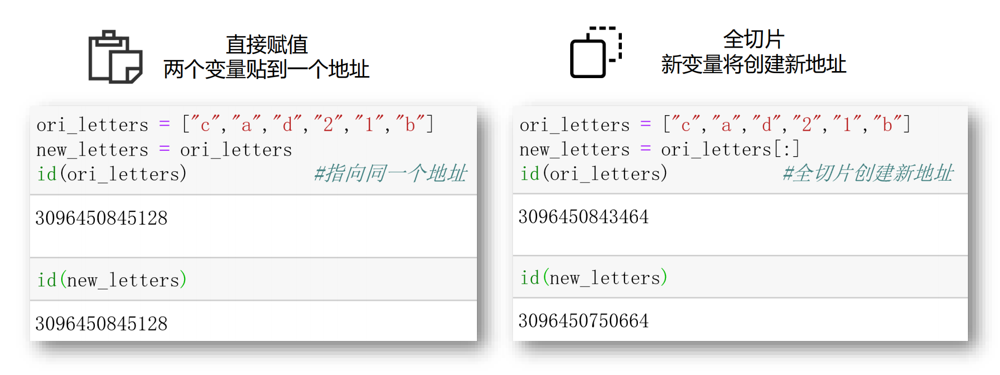
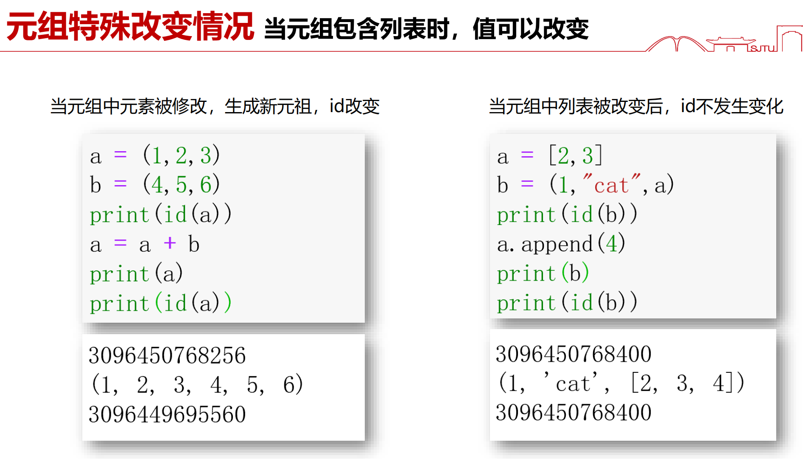
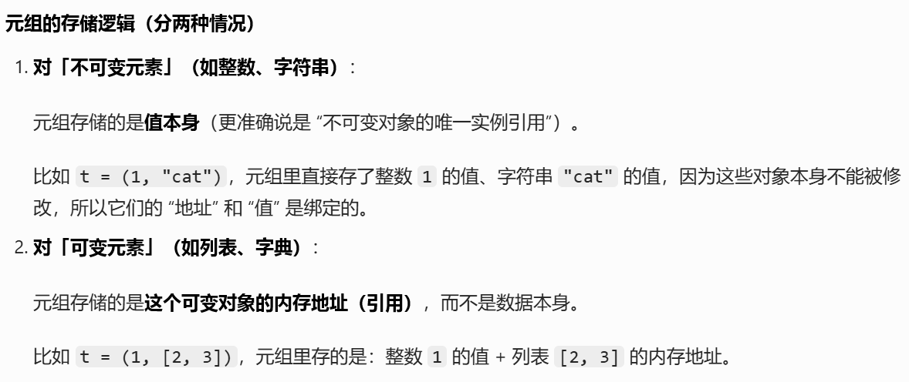

# Python 学习笔记

# 1.input()函数：提取一个str

input()函数默认的返回值就是str类型，如果你需要输入一个int数据，则要用：

```python
a=int(input("Enter your data"))
```

这个语句会先输出一个“Enter your data”

然后让你输入一个数据，此时input得到的是字符串

然后再转化成int类型数据，赋给a

# 2.range()函数：生成一个整数序列

range()函数是**左闭右开**的，也就是如果：

```python
for i in range(1,5):
	print(i*"⭐")
```

那么i会从1开始直到4

**注意**：range()默认生成的是一个整数序列，所以如果你想要例如0.5为间隔，你需要手动换算

# 3.print()函数：用逗号连接变量，最后自带换行

print()函数自带一个换行，如果需要去除这个换行，需要手动更改：

```python
for i in range(1,5):
    print(i*"⭐",end=" ")
```

那么会在同一行不断输出，同时以空格为分界

# 4.列表的赋值与切片



直接赋值是指向同一个地址！

而切片是生成一个新的地址，得到一个新的列表

# 5.对于可变的元素，元组存储的只是地址，元素变了，元组相当于也被改变了

