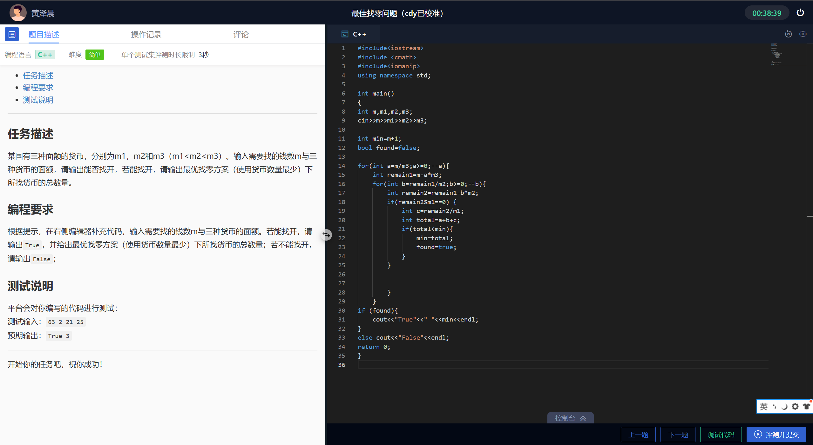
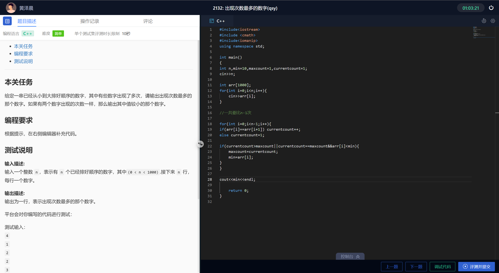
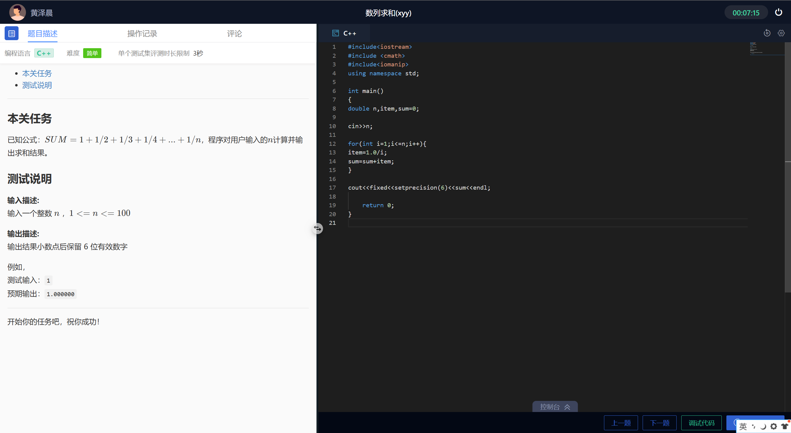
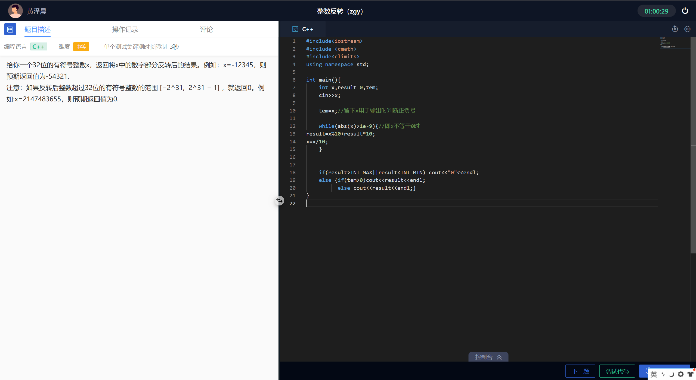

# 1、贪心算法



```c++
#include<iostream>
#include <cmath>
#include<iomanip>
using namespace std;

int main()
{
int m,m1,m2,m3;
cin>>m>>m1>>m2>>m3;

int min=m+1;
bool found=false;

for(int a=m/m3;a>=0;--a){//从最多张数开始，也可以从0张开始
    int remain1=m-a*m3;
    for(int b=remain1/m2;b>=0;--b){
        int remain2=remain1-b*m2;
        if(remain2%m1==0) {
            int c=remain2/m1;
            int total=a+b+c;
            if(total<min){
                min=total;
                found=true;//这个表示至少找到了一种
            }
        }
        

        }
    }
if (found){
    cout<<"True"<<" "<<min<<endl;
}
else cout<<"False"<<endl;
return 0;
}
```


# 2、连续出现次数最多的数字



**现在的数据，要用2个变量来操作，一个是currentcount用于计数，一个是current用于记录正在处理的数字**


**其次还要两个结果，一个是maxcount，实时更新，一个是maxcurrent，在更新maxcount的时候记下是哪个数字出现了这么多次**

```c++
#include<iostream>
#include <cmath>
#include<iomanip>
using namespace std;

int main()
{
int n,min=10,maxcount=1,currentcount=1;
cin>>n;

int arr[1000];
for(int i=0;i<n;i++){
    cin>>arr[i];
}

//一共要比n-1次

for(int i=0;i<n-1;i++){
if(arr[i]==arr[i+1]) currentcount++;
else currentcount=1;

if(currentcount>maxcount||currentcount==maxcount&&arr[i]<min){
    maxcount=currentcount;
    min=arr[i];
}
}

cout<<min<<endl;

	return 0;
}
```


# 3、注意运算的数据类型



注意第13行，不可以写item=1/i，否则当i<1时，item始终为0，因为这两个都是int型！

写成1.0/i就可以了！会转成double型运算

```c++
#include<iostream>
#include <cmath>
#include<iomanip>
using namespace std;

int main()
{
double n,item,sum=0;

cin>>n;

for(int i=1;i<=n;i++){
item=1.0/i;
sum=sum+item;
}

cout<<fixed<<setprecision(6)<<sum<<endl;

	return 0;
}
```


# 4、过程中可能出现数据溢出



x不能定义成int，如果定义成int，则在计算的过程中就会溢出这个范围，从而丢失掉应该有的值

应该把x定义为long long int

```c++
#include<iostream>
#include <cmath>
#include<climits>
using namespace std;

int main(){
    long long int x,result=0,tem;
    cin>>x;

    tem=x;//留下x用于输出时判断正负号

    while(abs(x)>1e-9){//即x不等于0时
result=x%10+result*10;
x=x/10;
    }


    if(result>INT_MAX||result<INT_MIN) cout<<"0"<<endl;
    else {if(tem>0)cout<<result<<endl;
          else cout<<result<<endl;}
}
```


# 5、红包典例中的算法积累

​	春节期间小明使用微信收到很多个红包，非常开心。在查看领取红包记录时发现，某个红包金额出现的次数超过了红包总数的一半。请帮小明找到该红包金额。例如，小明领到了红包金额分别为1 2 3 2 2，则其中有金额2出现次数超过了红包总数的一半，因此输出为2。如果没有金额超过了红包总数的一半，则输出0。

​	提示：一行红包输入结束的标志可以是回车'\n'或者特殊的EoF字符。特别地，以下代码当cin>>a碰到EoF字符时会退出循环，程序需要主动检查行尾'\n'字符：

```c++
int a;
while(cin>>a) {
    //将当前红包a保存至数组
    ...
    //检测'\n'字符后break
    ...
}
```


输入描述:
每个红包的金额。


输出描述:
出现次数过半的红包金额


测试输入：
1 2 3 2 2

预期输出：
2


范例：

```c++
#include <iostream>
using namespace std;

int main() {
    int hongbao[1000];  // 假设最多1000个红包
    int count = 0;
    int a;

    // 读取所有红包金额
    while (cin >> a) {
        hongbao[count] = a;
        count++;

        //这样可以获取红包的个数，即数组中有效数据的个数

                // 检查是否遇到换行符，如果是则结束输入
        if (cin.get() == '\n') {
            break;
        }
    }

    // 如果没有红包，输出0
    if (count == 0) {
        cout << 0 << endl;
        return 0;
    }


//下面开始处理数组中的数据，先寻找出现次数最多的数据


    // 创建数组，用于标记数据是否被统计过了
    bool checked[1000] = { false };
    
    int half = count / 2;
    int result = 0;

    // 遍历每个数字，统计出现次数
    for (int i = 0; i < count; i++) {
        // 如果这个数字已经统计过，跳过
        if (checked[i]) continue;

        int current = hongbao[i];//当前正在处理的数据
        int currentCount = 1;//当前数据出现的次数
        checked[i] = true;

        // 统计当前数字的出现次数
        for (int j = i + 1; j < count; j++) {//从第i+1开始直到最后
            if (hongbao[j] == current) {
                currentCount++;
                checked[j] = true;  // 标记为已统计
            }
        }

//至此，current这个数字出现的总次数已经被统计完成了，记录在CurrentCount中

        // 如果当前数字出现次数超过一半，记录结果
        if (currentCount > half) {
            result = current;
            break;  // 找到结果就退出
        }
    }

    cout << result << endl;
    return 0;
}
```

# 6、有序数组，用二分查找！

任务描述
本关任务：已知一个规模为n的有序整数数组，再输入整数x，判断x是否在数组中，如果是，则输出相应下标，如果否，则x插入数组哪个位置能够使数组仍然有序。

编程要求
根据提示，在右侧编辑器补充代码，输入正整数n(n<1000)，再输入n个有序整数以构成数组，再输入整数x，判断x是否在数组中，如果是，则输出相应下标，如果否，则求出x插入数组哪个位置能够使数组仍然有序。尽量提高算法效率。

```c++
int left=0,right=n-1;
while(left<=right){//left和right尚未错开，注意重合是可以的！
    int mid=(left+right)/2;
    if(data[mid]==x) {
        cout<<mid;
        found=true;
        break;
        }
    else if(data[mid]>x) right=mid-1;
    else if(data[mid]<x) left=mid+1;
}

if(found==false){//这个地方千万注意是双等号！bool数据类型也要注意双等号
    cout<<left<<endl;//二分查找结束后，left是第一个大于x的位置，right是第一个小于x的位置，二者错开之间是本该有的x
}
```

# 7、查找鞍点的思路

​	在矩阵中，一个元素在所在行是最大值，在所在列是最小值，则被称为鞍点。输入两个正整数m和n(m,n<=10)，然后输入该m行n列矩阵中的元素，如果找到矩阵的鞍点(最多只有一个)，则输出其下标，否则输出“Not Found”。


**思路：**先找每一行中最大的元素，再**选定它所在的列**，看看它所在的列中它是不是最小的元素


# 8、冒泡排序模板

任务描述
使用冒泡排序对数组中的元素进行从小到大顺序排序。

编程要求
根据提示，在右侧编辑器补充代码，用户输入一组整数（不超过1000个），使用冒泡排序对数组中的元素进行从小到大顺序排序，输出排序后数组中的元素，元素之间用一个空格隔开

```c++
#include <iostream>
using namespace std;

int main()
{
int arr[1000];
int a,count=0;
while(cin>>a){
    arr[count]=a;
    count++;
    
    if (cin.get() == '\n') {
    break;
    }
}

//得到有效数据个数为count，但是注意数组中的下标为0至count-1

for(int i=0;i<count-1;i++){//一共count-1轮冒泡，每一轮冒泡有若干次比较，并且找出那个更小的数，这个i代表已经排好了多少个数字
	int swapcount=0;
	for(int j=0;j<count-i-1;j++){//还剩下了count-i个数字没有排好，最后一个没有排好的数字的下标为count-i-1
    	if(arr[j]>arr[j+1]){
        	int tem=arr[j];
        	arr[j]=arr[j+1];
        	arr[j+1]=tem;
        	swapcount++;
    		}
   		}
    if(swapcount==0) break;
}

	for(int i=0;i<count;i++){
	cout<<arr[i]<<" ";
	}

return 0;
}
```

# 9、滑动窗口法（更新思想）

任务描述
本关任务：计算无重复字符的最长子串的长度

编程要求
根据提示，在右侧编辑器补充代码，用户字符串s，找出该字符串中无重复字符的**最长子串的长度**

测试说明
平台会对你编写的代码进行测试：

测试输入：
abcabcbb

预期输出：
3
解释：最长的无重复字符的子串为abc，长度为3

方法介绍：滑动窗口
滑动窗口的右边界不断的右移，只要没有重复的字符，就持续向右扩大窗口边界。⼀旦出现了重复字符，就需要缩小左边界，直到重复的字符移出了左边界，然后继续移动滑动窗口的右边界。以此类推，每次移动需要计算当前长度，并判断是否需要更新最大长度，最终最大的值就是题目中的所求

```c++
#include <iostream>
using namespace std;

int main() {
    char arr[1000];
    cin >> arr; // 读取输入字符串

    int max_len = 0; // 最长无重复子串的长度
    int len = 0;
    
    // 获取数组有效长度，手动遍历
    while (arr[len] != '\0') {
        len++;
    }

    // 设置子串的起点
    for (int i = 0; i < len; ++i) {
        // 对于每个起点，设置当前子串的长度
        int current_len = 0;
        // 设置子串的终点
        for (int j = i; j < len; ++j) {
            // 标记最右侧新加入的字符是否在子串中已经出现了
            bool repeat = false;
            for (int k = i; k < j; ++k) {//关键：只要验证右侧新加入的这个是否重复即可！
                if (arr[k] == arr[j]) {//若出现重复
                    repeat = true;
                    break;//出现了重复，则终止验证
                }
            }
            if (repeat) break; // 出现重复，终止当前子串向右延伸
            else current_len++; // 若无重复，子串长度+1
        }
        
        // 更新最长长度
        if (current_len > max_len) {
            max_len = current_len;
        }
    }

    cout << max_len << endl;
    return 0;
}
```

1. **手动计算字符串长度：**通过`while`循环遍历到`'\0'`（字符串结束符）来得到长度。
2. **三重循环遍历**：
   - 外层循环：遍历每个字符作为子串的**起点`i`**。
   - 中层循环：从起点`i`向后扩展子串的**终点`j`**。
   - 内层循环：检查当前字符`arr[j]`是否在`[i, j-1]`（当前子串）中出现过。
3. **记录最长长度**：每次扩展子串后，更新`max_len`为当前最长的子串长度。

# 10、顺时针填充数组

本关任务
给出一个正整数 n ，请将从 1 到 n^2 这些数字按照顺时针的顺序填入二维矩阵中。

编程要求
根据提示，在右侧编辑器补充代码。

测试说明
输入描述:
输入一个正整数 n (1≤n≤10)。
输出描述:
输出旋转后的二维数组。

平台会对你编写的代码进行测试：

测试输入：
3
预期输出：
1 2 3
8 9 4
7 6 5

开始你的任务吧，祝你成功！
注意，每个数字后面仅有一个空格

```c++
#include<iostream>
using namespace std;

int main() {
    int n;
    cin >> n;
    int arr[10][10] = {0}; // 初始化数组，避免随机值

    int current = 1, top = 0, bottom = n - 1, left = 0, right = n - 1;

    // 循环填充，直到所有数字（1到n²）都填入
    while (current <= n * n) {
        // 1. 从左到右填充上边界行
        for (int i = left; i <= right; i++) {
            arr[top][i] = current;
            current++;
        }
        top++; // 上边界下移

        // 2. 从上到下填充右边界列
        for (int i = top; i <= bottom; i++) {
            arr[i][right] = current;
            current++;
        }
        right--; // 右边界左移

        // 3. 从右到左填充下边界行（需判断仍有行可填）
        if (top <= bottom) {
            for (int i = right; i >= left; i--) {
                arr[bottom][i] = current;
                current++;
            }
            bottom--; // 下边界上移
        }

        // 4. 从下到上填充左边界列（需判断仍有列可填）
        if (left <= right) {
            for (int i = bottom; i >= top; i--) {
                arr[i][left] = current; // 修正：填充左边界列（列索引为left）
                current++;
            }
            left++; // 左边界右移
        }
    }

    // 输出矩阵，每个数字后加一个空格
    for (int i = 0; i < n; i++) {
        for (int j = 0; j < n; j++) {
            cout << arr[i][j] << " ";
        }
        cout << endl;
    }

    return 0;
}
```

而我的答案：

```c++

#include<iostream>
using namespace std;

int main()
{
int n;
cin>>n;
int arr[10][10];

int current=1,top=0,bottom=n-1,left=0,right=n-1;

//填充最上面行
for(int i=left;i<=right;i++){
    arr[top][i]=current;
    current++;
}
top++;

//填充最右边列
for(int i=top;i<=bottom;i++){
    arr[i][right]=current;
    current++;
}
right--;

//最下面行
if(top>=bottom){
for(int i=right;i>=left;i--){
    arr[bottom][i]=current;
    current++;
}
bottom--;
}

//最左边列
if(left<=right){
for(int i=bottom;i>=top;i--){
    arr[i][left]=current;
    current++;
}
left++;
}


for(int i=0;i<n;i++){
    for(int j=0;j<n;j++){
        cout<<arr[i][j];
    }
    cout<<endl;
}
	return 0;
}
```

**豆包：**

你的代码存在以下几个问题，导致无法正确生成顺时针填充的矩阵：

### 1. 填充逻辑不完整，仅执行了一轮操作

​	顺时针填充矩阵需要**循环执行 “右→下→左→上”** 的步骤，直到所有数字（1 到 n²）都被填入。但你的代码只执行了一次这四个步骤，没有循环，因此只能填充矩阵的最外层，无法填充中间的数字（例如 n=3 时，中间的 9 无法填充）。

### 2. 条件判断错误

​	填充 “最下面行” 时，条件应为 `if(top <= bottom)`（表示仍有未填充的行），而不是 `if(top >= bottom)`，否则会跳过该行填充。注意top反而是最小的！

### 3. 未初始化数组，可能输出随机值

​	定义数组 `int arr[10][10];` 时未初始化，对于未填充到的位置（例如 n=3 时的中间位置），会输出随机的垃圾值，而不是正确的数字。

# 11、最少点击次数（更新思想）

任务描述
本关任务：5*5的格子中，每个格子代表一盏灯，点击一次，此格子和上下左右相邻的共5个格子中的灯的状态会发生反转，亮着的会熄灭，熄灭的会点亮。如何用最少的点击次数使所有的灯都点亮？（亮灯用1表示，熄灭状态用0表示）

编程要求
根据提示，在右侧编辑器补充代码，输入五行，每行五个数值(0或1)，表示当前格子的状态。输出对于输入数据中对应的当前状态最少需要几步才能使25个格子都变亮。如果不能使25个格子都变亮，输出-1。尽量提高计算效率。

测试说明
平台会对你编写的代码进行测试：

测试输入：
00111
01011
10001
11010
11100
预期输出：
3
输出说明：点击(0,0)，（2,2）和（4,4）

提示：如果第一行5个格子的操作方案确定了，那么为了满足所有灯亮，其它四行各个格子的操作方案也就确定了

```c++
#include <iostream>
using namespace std;

void flip(int grid[5][5],int i,int j){//一个数组中的i，j位置元素
if(grid[i][j]==0){
    grid[i][j]=1;
}else{grid[i][j]=0;}

//若存在上面的格子，则翻转
if(i>0){
    if(grid[i-1][j]==0){
    grid[i-1][j]=1;
}else{grid[i-1][j]=0;}
}
//若存在下面的格子
if(i<4){
    if(grid[i+1][j]==0){
    grid[i+1][j]=1;
}else{grid[i+1][j]=0;}
}
//左边的
if(j>0){
    if(grid[i][j-1]==0){
    grid[i][j-1]=1;
}else{grid[i][j-1]=0;}
}
//右边的
if(j<4){
    if(grid[i][j+1]==0){
    grid[i][j+1]=1;
}else{grid[i][j+1]=0;}
}

}


int main()
{

int grid[5][5];

string line;
for(int i=0;i<5;i++){
    cin >> line;  // 读取整行字符串
    for(int j=0;j<5;j++){
        grid[i][j] = line[j] - '0';  // 将字符转为数字（'0'->0, '1'->1）
    }
}


int minSteps = 10000;
for(int c0 = 0; c0 <= 1; c0++){
    for(int c1 = 0; c1 <= 1; c1++){
        for(int c2 = 0; c2 <= 1; c2++){
            for(int c3 = 0; c3 <= 1; c3++){
                for(int c4 = 0; c4 <= 1; c4++){
                    
                    int temp[5][5];

                    for (int i = 0; i < 5; ++i) {
                    for (int j = 0; j < 5; ++j) {
                    temp[i][j] = grid[i][j];
                    }
                    }//复制原来的数组

                    int steps=0;

                    if(c0) { flip(temp,0,0); steps++; }
                    if(c1) { flip(temp,0,1); steps++; }
                    if(c2) { flip(temp,0,2); steps++; }
                    if(c3) { flip(temp,0,3); steps++; }
                    if(c4) { flip(temp,0,4); steps++; }

                    //第一行操作结束，操作下面的行
                    for(int i=1;i<5;i++){
                        for(int j=0;j<5;j++){
                            if (temp[i-1][j]==0) {flip(temp,i,j);steps++;}//上一个如果是0，则要点击目前这个
                        }
                    }

                    //检查最后一行是否都是1
                    bool all1=true;
                    for(int j=0;j<5;j++){
                        if(temp[4][j]==0){
                            all1=false;
                            break;
                        }
                    }

                    if(steps<minSteps&&all1==true)minSteps=steps;

                }
            }
        }
    }
}

if(minSteps!=10000)cout<<minSteps<<endl;
else cout<<"-1"<<endl;

    return 0;
}
```

### 1. 全局 / 函数参数相关变量

- `grid[5][5]`：

  主函数中定义的 5x5 二维数组，用于存储输入的初始网格状态（0 表示灯灭，1 表示灯亮）。

- `temp[5][5]`：

  临时二维数组，在每次尝试不同操作方案时，复制`grid`的初始状态，用于模拟翻转操作（避免直接修改原始网格）。

- `i, j`（`flip`函数参数及循环变量）：

  表示网格中的行索引和列索引（范围 0-4，对应 5x5 网格的位置）。在`flip`函数中，`i,j`是当前要翻转的目标位置；在循环中用于遍历网格的行和列。

### 2. 输入相关变量

- ```
  line
  ```

  ：

  

  字符串变量，用于读取输入的每一行（共 5 行），再将每行的字符转换为数字存入

  ```
  grid
  ```

  数组。

### 3. 翻转操作相关变量

- ```
  c0, c1, c2, c3, c4
  ```

  ：

  

  整数变量（0 至 1），分别表示是否对第一行的第 0-4 列位置执行翻转操作（1 表示翻转，0 表示不翻转）。通过 5 重循环枚举第一行所有可能的操作组合（共 2^5=32 种）。

### 4. 计数与状态判断变量

- `steps`：

  整数变量，记录当前操作方案中执行翻转的总次数（步骤数），用于统计每种方案的操作步数。

- `minSteps`：

  整数变量，初始值设为较大的 10000，用于存储所有有效方案（能使网格全亮）中的最小步骤数。

- `all1`：

  布尔变量，用于判断操作结束后最后一行是否全为 1（`true`表示全亮，`false`表示存在灭灯）。只有当`all1`为`true`时，当前方案才是有效的。

### 总结

代码通过枚举第一行的所有翻转可能，再根据每行状态决定下一行的翻转操作，最终检查最后一行是否全亮，从而找到使网格全亮的最少步骤。变量设计围绕网格状态存储、操作枚举、步骤计数和有效性判断展开，逻辑清晰对应解决问题的流程。


# 12、改动之后的最长连续1的个数

本关任务
给定一个只有0和1组成的数组，如果允许将其中的某一个0改成1, 找出其中最长的连续1的长度。

编程要求
根据提示，在右侧编辑器补充代码。用户输入一个整数n，表示有n个数字，其中0<n<1000，然后输入n个数字，这些数字为0或1。输出允许将其中的某一个0改成1之后最长的连续1的长度。

测试说明
平台会对你编写的代码进行测试：

测试输入：
9
1 0 0 1 1 1 0 1 1
预期输出：
6
输出说明：将最后1个0改成1, 数组变为{1 0 0 1 1 1 1 1 1}, 连续1的长度最长为6


我的思路：先遍历数组找出哪些数据为0，逐个改为1之后再遍历整个数组，查找最长的连续1个数，每次改动currentlength之后就马上更新maxlength从而保住数据，因为currentlength马上就又要变化了！

```c++
#include <iostream>
using namespace std;

int main()
{
int n;
cin>>n;
int arr[1000];
for(int i=0;i<n;i++){
    cin>>arr[i];
}

int maxlength=0,currentlength=0;

int zero[1000];
int num=0;
for(int i=0;i<n;i++){
    if(arr[i]==0){zero[num]=i;num++;}//zero用于储存为0数据的下标，num为最后一个数据的下标，一共有num+1个数据
}


if(num==0) cout<<n<<endl;

else {for(int i=0;i<num;i++){//若此处num为0，即全为1，则这个循环无法进入，故要在之前判断num是否为0！
    arr[zero[i]]=1;//把选定的这个0改成1，之后遍历数组找出最长的连续1
    for(int j=0;j<n;j++){
        if(arr[j]==1)currentlength++;//如果对了，就加一
        else if(arr[j]==0)currentlength=0;//如果不对，就清零，从下一个开始，重新开始计数
        if(currentlength>maxlength) maxlength=currentlength;//每次更改完currentlength，更新一下最值，留住数据，因为currentlength又要变化了！
    }
    arr[zero[i]]=0;//把这个1又改回去
}

cout<<maxlength<<endl;
}

    return 0;
}
```

# 13、将矩阵顺时针旋转90°

任务描述
本关任务：将给定的N*N矩阵顺时针转动90度

编程要求
根据提示，在右侧编辑器补充代码，先输入正整数N，然后输入规模为N*N的矩阵M，将M顺时针旋转90度

测试说明
平台会对你编写的代码进行测试：

测试输入：
4
1 2 3 4
5 6 7 8
9 10 11 12
13 14 15 16

预期输出：
13 9 5 1
14 10 6 2
15 11 7 3
16 12 8 4

```c++
#include <iostream>
using namespace std;

void rotateMatrix(int N, int M[100][100]) {//下标从0到N-1
//旋转数组代码，这些复杂的交换即为平板上画图找出来的规律！
    for(int i=0;i<N/2;i++){//行
        for(int j=i;j<=N-2-i;j++){//列
        int tem=M[i][j];
        M[i][j]=M[N-1-j][i];
        M[N-1-j][i]=M[N-1-i][N-1-j];
        M[N-1-i][N-1-j]=M[j][N-1-i];
        M[j][N-1-i]=tem;
        }
    }
}

void printMatrix(int N, int M[100][100]) {
//打印数组代码 
    for(int i=0;i<N;i++){
        for(int j=0;j<N;j++){
            cout<<M[i][j]<<' ';
        }
        cout<<endl;
    }
}

int main() {
    int N;
    cin >> N;
    
    int M[100][100];

    for (int i = 0; i < N; i++) {
        for (int j = 0; j < N; j++) {
            cin >> M[i][j];
        }
    }
    // 旋转矩阵
    rotateMatrix(N, M);
    
    // 输出旋转后的矩阵
    printMatrix(N, M);
    return 0;
}

```

# 14、小母牛繁殖问题

若一头小母牛，从出生起第四个年头开始每年生一头母牛，按此规律，第n年时有多少头母牛。（用递归函数方法求解）

测试说明
平台会对你编写的代码进行测试：

测试输入：7
预期输出：6

关键：生出来的母牛在4年之后也会变为能够生小母牛的个体！

故递推关系应该是f(n)=f(n-1)+f(n-3)，不是f(n)=f(n-1)+1

```c++
#include<iostream>
using namespace std;

int f(int n)
{
if(n<=3) return 1;
else return f(n-1)+f(n-3);
}

int main()
{
int n;
cin >> n;
cout << f(n) << endl;
return 0;
}
```

# 15、统计n的阶乘末尾0的个数

已知阶乘的定义为 n! = n * (n-1) * ... * 1，请实现countFactorialZero函数，计算 n! 末尾0的数目。比如 n = 4, n! = 24，末尾0的数量为0；n = 7, n! = 5040，末尾0的数量为1。

编程要求
根据提示，在右侧编辑器补充代码。

测试说明
输入描述:
输入一个正整数n (n < 50)

输出描述:
输出 n! 末尾0的数量

平台会对你编写的代码进行测试：
测试输入：
5
预期输出：
1

```c++
#include <iostream>
using namespace std;

int countFactorialZero(int n) {
    int count = 0;
    while (n > 0) {
        n /= 5;
        count += n;
    }
    return count;
}

int main() {
    int n;
    cin >> n;
    cout << countFactorialZero(n) << endl;
    return 0;
}

```

- 要彻底理解 “统计因子 5 的个数” 这种方法，我们需要从「阶乘末尾 0 的本质」→「因子 2 和 5 的数量关系」→「统计逻辑推导」→「实例验证」逐步拆解，全程用通俗的语言 + 具体例子说明：

  ## 一、核心前提：阶乘末尾的 0 从哪来？

  末尾的 0，本质是 **10 的倍数** 带来的 —— 而 10 只能由 `2 × 5` 相乘得到（10 是质数 2 和 5 的唯一组合）。

  比如：`5! = 120`（末尾 1 个 0），本质是 `5! = 1×2×3×4×5 = (2×2×2) × (5) × (3)` → 这里有 3 个因子 2、1 个因子 5，只能组成 1 对 `2×5`，所以末尾 1 个 0；

  再比如：`10! = 3628800`（末尾 2 个 0），本质是 `10!` 中包含 2 个因子 5（5 和 10）、更多因子 2，能组成 2 对 `2×5`，所以末尾 2 个 0。

  结论 1：**阶乘末尾 0 的个数 = 阶乘中能组成的「2×5」对数**。

  ## 二、关键观察：因子 2 的数量永远比 5 多

  在阶乘中，因子 2 的数量一定 ≥ 因子 5 的数量 —— 因为每 2 个数就会出现一个能提供因子 2 的数（2、4、6、8、10...），而每 5 个数才会出现一个能提供因子 5 的数（5、10、15、20、25...）。

  比如：`25!` 中：

  - 因子 2 的个数：`25/2 + 25/4 + 25/8 + 25/16 = 12+6+3+1=22` 个；
  - 因子 5 的个数：`25/5 + 25/25 = 5+1=6` 个；
  - 能组成的「2×5」对数 = 6（由较少的因子 5 决定），所以 `25!` 末尾有 6 个 0（实际 `25! = 15511210043330985984000000`，末尾确实 6 个 0）。

  结论 2：**只需要统计阶乘中因子 5 的总个数，就是末尾 0 的个数**（因子 2 足够多，无需统计）。

  ## 三、如何统计因子 5 的总个数？

  ### 1. 基础逻辑：每 5 个数贡献 1 个 5

  比如 `n=32`，能提供因子 5 的数是：5、10、15、20、25、30 → 共 `32/5 = 6` 个（这一步是统计 “至少含 1 个因子 5” 的数）。

  ### 2. 特殊情况：有些数含多个因子 5

  比如 25（`5×5`）、50（`2×5×5`）、75（`3×5×5`）、125（`5×5×5`）等，这些数除了本身算 1 个 5，还额外多提供 1 个（或多个）5。

  - 比如 `n=32` 中，25 是 `5×5`，额外多 1 个 5 → 这一步需要统计 “含 2 个及以上因子 5” 的数，即 `32/25 = 1` 个；
  - 再比如 `n=125`，125 是 `5×5×5`，还需要统计 `125/125 = 1` 个（含 3 个因子 5 的数）。

  ### 3. 通用公式：循环累加商

  直到 `n/5^k = 0` 时停止（此时没有更多含 k 个因子 5 的数了），总个数 = `n/5 + n/25 + n/125 + n/625 + ...`。

  #### 实例验证：n=32

  - 第一步：32/5 = 6（5、10、15、20、25、30 → 6 个 5）；
  - 第二步：32/25 = 1（25 → 额外 1 个 5）；
  - 第三步：32/125 = 0（没有含 3 个 5 的数，停止）；
  - 总因子 5 个数 = 6+1=7 → 所以 `32!` 末尾有 7 个 0（和你之前的测试预期一致）。

  再比如 n=100：

  - 100/5=20（20 个含 1 个 5 的数）；
  - 100/25=4（25、50、75、100 → 额外 4 个 5）；
  - 100125=0（停止）；
  - 总个数 = 20+4=24 → `100!` 末尾有 24 个 0（实际验证正确）。

  ### 四、为什么这种方法比 “先算阶乘” 好？

  1. **无溢出**：不管 n 多大（哪怕 n=1e9），都只做除法和加法，不会出现阶乘溢出的问题；
  2. **效率极高**：时间复杂度是 `O(log₅n)`—— 比如 n=1e9 时，`log₅(1e9)≈13`，只需要循环 13 次就结束；
  3. **通用性强**：适用于所有 n≥0（n=0 或 1 时，因子 5 个数为 0，末尾 0 的个数也为 0）。
  
  ## 16、单词反转
  
  本关任务：编写一个能将字符串中每个单词都翻转的函数。
  
  编程要求
  根据提示，在右侧编辑器补充代码，将字符串中的每个单词都翻转，单词之间用空格分割。
  
  测试说明
  平台会对你编写的代码进行测试：
  
  测试输入：
  I am a good student
  
  预期输出：
  I ma a doog tneduts
  
  ```c++
  #include <iostream>
  #include <cstring>
  using namespace std;
  
  // 函数：翻转每个单词
  void reverseWord(char str[]) {
      int i=0;
      while(str[i]!='\0'){//做出一个循环来，使得只要没结束，能不断地处理单词
          int start=i;
          while(str[i]!=' '&&str[i]!='\0'){//i最后停在' '处或'\0'处，哨兵循环的作用巨大！
              i++;
          }
          int end=i-1;
          //下面开始处理这个单词
          while(start<end){//这个很重要，一定要用于使用哨兵循环！而不只是会用for循环！
              int temp=str[end];
              str[end]=str[start];
              str[start]=temp;//首尾完成互换
  
              start++;
              end--;//这两行是核心，能够让单词完整地互换
          }//目前的单词完成反转
          if(str[i]=='\0') return;//若已经结束了，直接return就可以退出
          else i++;//进入下一个单词
      }
  }
  
  int main() {
      char str[10000];
      // 从标准输入读取字符串
      cin.getline(str, 10000);
  
      // 翻转每个单词
      reverseWord(str);
  
      // 输出结果
      cout << str;
  
      return 0;
  }
  
  ```
  
  一定要学会善于使用哨兵循环！而使用时一定记得要i++这个条件！用多了for循环容易忘记！
  
  # 17、潜水最佳策略


有一支N人组成的队伍，要求所有队员从A河岸潜水到B河岸所用的时间最少。具体要求，在潜水时必须使用氧气瓶，并且一次潜水只能使用一个氧气瓶，每个氧气瓶最多供两人同时使用。如果两人共用氧气瓶的话，则两人到达终点的时间等于潜游较慢的一个人单独游到终点所需的时间。编程实现并输出最优潜水策略和团体一共用时。

输入说明
首先输入某个队伍的人数N（N<100），接着依次输入N个队员单独游到终点所需时间。例如：
3 1 4 3

输出说明
例如，上面输入对应的输出为：
5

解释：第一次安排队员1单独潜水，用时为1；第二次安排队员2和队员3共同潜水，用时为4；第三行输出所有队员最短潜水总用时为5。注意，一次潜水只能用一个氧气瓶，即一次潜水最多只能是两个人

```c++
#include <iostream>
using namespace std;

int main(){
    //输入数组
    int n;
    cin>>n;
    int arr[100];
    for(int i=0;i<n;i++){
        cin>>arr[i];
    }

    //给数组进行冒泡排序，从大到小排序
for(int i=0;i<n-1;i++){
    int swapcount=0;
    for(int j=0;j<n-i-1;j++){
    if(arr[j]<arr[j+1]){
        int tem=arr[j];
        arr[j]=arr[j+1];
        arr[j+1]=tem;
        swapcount++;
    	}
   	}
    if(swapcount==0) break;
}
//至此已经排序成功，依次选取最大的两两组队
//为偶数之时
int timesum=0;
if(n%2==0){
for(int i=0;i<n;i=i+2){
    timesum+=arr[i];
}
}
//为奇数之时
if(n%2==1){
    for(int i=0;i<n;i=i+2){
    timesum+=arr[i];
    }
}


cout<<timesum<<endl;

}
```

由平板画图得到最佳策略

# 18、快速排序

样例输入
5
3 1 2 4 5

样例输出
1
2
3
4
5

```c++
#include <iostream>
using namespace std;
/******完成快速法排序************/

int divide(int a[],int low,int high){
    int k=a[low];//此时low空出来了

    do{
        while(low<high&&a[high]>=k)high--;//先动high，找到合适的填充low
        if(low<high){
            a[low]=a[high];//此时high空出来了
            low++;
        }
        while(low<high&&a[low]<=k)low++;
        if(low<high){
            a[high]=a[low];//此时low又空出来了又要移动high，重新开始循环
            high--;
        }
    }while(low<high);
    a[low]=k;//把k放到两段之间

    return low;//返回下标，方便做分割，从而前一半和后一半可以递归排序，实现分而治之
}

void quicksort(int a[],int low,int high){ 
int mid;

if(low>=high) return;
mid=divide(a,low,high);
quicksort(a,low,mid-1);
quicksort(a,mid+1,high);

}
int main(){
    int num;
    cin>>num;
    int *arr = new int[num];

    for(int i=0;i<num;i++){
        cin>>arr[i];
    }
    quicksort(arr, 0, num-1);
    for(int i=0;i<num;i++){
        cout<<arr[i]<<endl;
    }
    return 0;
}
```

具体思想在课本p130

# 19、字符串验证

编写一个函数int strinstr(char a[], char b[])，strinstr的功能是用户输入两个字符串a, b，输出b在a中第一次出现的下标，如果未出现则输出-1.

测试说明
平台会对你编写的代码进行测试：

测试输入：
onlinejudge
line
预期输出：
2

测试输入2：
myfriend
fried
预期输出2：
-1

预期输入3：
123acacf
ac
预期输出3：
3

```c++
#include <iostream>
using namespace std;

// 此处实现strinstr函数

int strinstr(char a[], char b[]) {
    bool flag = false;
    int i = 0;
    int first;

    while (flag == false) {
        int j = 0;
        while (a[i] != b[0]) { 
            if (a[i] != '\0') i++;
            else break;
        }//直到第一个字母重合，若未出现则直接退出！
        //之前我在这里没判断a[i]和'\0'，出现了死循环！
        first = i;
        while (a[i] == b[j] && b[j] != '\0' && a[i] != '\0') {//写全条件不易错
            i++;
            j++;
        }
        if (b[j] == '\0') flag = true;
        if (a[i] == '\0') break;
    }
    if (flag == true) return first;
    else return -1;
}

int main()
{
    char a[81], b[81];

    cin.getline(a, 81);
    cin.getline(b, 81);
    cout << strinstr(a, b);
    return 0;
}
```

用此题训练while的使用！！！

# 20、课堂小测题目，指针混合

### 一、问题内容整理

#### 问题 1 题目内容

已知以下 C++ 代码，求程序的输出结果：

```cpp
#include <iostream>
using namespace std;

int *transfer(int &q) {
    q *= 2;
    int *p = new int(q);
    return p;
}

int main() {
    int a[8] = {1, 2, 3, 4, 5, 6, 7, 8};
    for (int i = 0; i < 8; i++) {
        int *p = transfer(a[i]);
        a[i] += *p;
        cout << a[i] << endl;
        delete p;
    }
    return 0;
}
```

#### 问题 2 题目内容

已知以下 C++ 代码，求程序的输出结果：

```cpp
#include <iostream>
using namespace std;

int main() {
    int a[8] = {1, 2, 3, 4, 5, 6, 7, 8};
    int *p;
    int *&q = p; // q是指针p的引用
    p = a;       // p指向数组a的首地址
    for (int i = 1; i < 8; i++) {
        cout << p[*q];
        p += i;
        if (p[i] == 6) {
            break;
        }
    }
    cout << endl;
    cout << sizeof(q) << endl;
    return 0;
}
```

### 二、问题 1 解决步骤及核心总结

#### 1. 详细解决步骤

##### 步骤 1：分析`transfer`函数功能

- 函数参数：`int &q`（int 类型引用，修改 q 会直接影响原变量）。
- 函数逻辑：
  1. 对引用参数`q`执行`q *= 2`（原变量翻倍）；
  2. 动态分配 1 个 int 类型内存，值为修改后的`q`；
  3. 返回该动态内存的指针。

##### 步骤 2：分析`main`函数循环（i 从 0 到 7，遍历数组 a）

循环核心公式：`a[i] = 原a[i] * 2（transfer内修改） + 动态分配的数值（即修改后的a[i]） = 原a[i] * 4`

- i=0：原 a [0]=1 → 翻倍为 2 → a [0] += 2 → 4 → 输出 4；
- i=1：原 a [1]=2 → 翻倍为 4 → a [1] += 4 → 8 → 输出 8；
- i=2：原 a [2]=3 → 翻倍为 6 → a [2] += 6 → 12 → 输出 12；
- i=3：原 a [3]=4 → 翻倍为 8 → a [3] += 8 → 16 → 输出 16；
- i=4：原 a [4]=5 → 翻倍为 10 → a [4] += 10 → 20 → 输出 20；
- i=5：原 a [5]=6 → 翻倍为 12 → a [5] += 12 → 24 → 输出 24；
- i=6：原 a [6]=7 → 翻倍为 14 → a [6] += 14 → 28 → 输出 28；
- i=7：原 a [7]=8 → 翻倍为 16 → a [7] += 16 → 32 → 输出 32。

##### 步骤 3：输出结果

循环中每次输出`a[i]`并换行，最终输出 8 行数值。

#### 2. 核心步骤总结

1. 明确`transfer`函数的双重作用：引用修改原变量（翻倍）+ 动态分配返回同值指针；
2. 推导数组元素的计算逻辑：`a[i] = 原数值 * 4`；
3. 遍历数组计算并逐行输出结果。

#### 3. 问题 1 输出结果

```plaintext
4
8
12
16
20
24
28
32
```

### 三、问题 2 解决步骤及核心总结

#### 1. 详细解决步骤

##### 步骤 1：分析指针引用关系

- `int *&q = p`：q 是指针 p 的引用（别名），q 和 p 指向同一地址，操作 q 等价于操作 p；
- `p = a`：p 指向数组 a 的首地址（a [0]），因此 q 也指向 a [0]。

##### 步骤 2：分析 for 循环（i 从 1 到 7，满足条件则 break）

循环核心：计算`p[*q]`（*q 是当前 p 指向的数组元素值，作为 p 的偏移量）、移动 p、判断终止条件。

- 第一次循环（i=1）：
  1. `p[*q]`：*q = *p = a [0] = 1 → p [1] = a [1] = 2 → 输出 2；
  2. `p += i`：p 移动 1 个位置，指向 a [1]；
  3. 条件判断：p [i] = p [1] = a [2] = 3 ≠ 6 → 继续循环。
- 第二次循环（i=2）：
  1. `p[*q]`：*q = *p = a [1] = 2 → p [2] = a [1+2] = a [3] = 4 → 输出 4；
  2. `p += i`：p 移动 2 个位置，指向 a [3]；
  3. 条件判断：p [i] = p [2] = a [3+2] = a [5] = 6 → 满足条件，break 循环。

##### 步骤 3：分析`sizeof(q)`的结果

- q 是指针的引用，本质仍等价于指针（引用不占用额外内存，sizeof (q) = sizeof (p)）；
- 32 位系统：指针大小 = 4 字节 → 输出 4；

##### 步骤 4：输出结果

先连续输出 2 和 4（无空格），换行后输出 sizeof (q) 的结果。

#### 2. 核心步骤总结

1. 理解指针引用的本质：q 是 p 的别名，二者同指向、同大小；
2. 掌握`p[*q]`的计算逻辑：*q 是当前 p 指向的元素值，作为数组偏移量；
3. 跟踪循环中 p 的移动和终止条件（p [i] == 6）；
4. 根据系统位数确定`sizeof(q)`的结果。

#### 3. 问题 2 输出结果

```plaintext
24
4
```

# 21、数据类型溢出的小坑

在电子信息与电气工程学院有一个长腿君，他在爬楼梯的时候从来都是要么上2个台阶，要么上3个台阶。如果长腿君需要爬N阶台阶，你能告诉长腿君，他爬楼梯有多少种不同的方式吗？

请注意，长腿君“先爬 3个台阶后爬2个台阶”和“先爬2个台阶后爬 3个台阶”是两种不同的方式。

```c++
#include <iostream>
using namespace std;

int p(int x){
    int result=1;
    for(int i=1;i<=x;i++){
        result*=i;
    }
    return result;
}

int zhongshu(int a,int b){
    return p(a+b)/(p(a)*p(b));
}

int main(){
int sum=0;
int n;
cin>>n;
for(int i=0;3*i<=n;i++){//i为走3步的次数
if((n-3*i)%2==0){
    int a=i;
    int b=(n-3*i)/2;
    sum+=zhongshu(a,b);
}
}
cout<<sum<<endl;

return 0;
}
```

存在数据溢出，导致输入稍大时结果错误：

`int` 类型的最大值约为 21 亿（32 位系统），而阶乘 `p(x)` 增长极快：

- `p(12) = 479001600`（接近 `int` 上限）；
- `p(13) = 6227020800`（远超 `int` 范围，直接溢出为负数 / 垃圾值）。

当输入 `n >= 12` 时，`a+b = i + (n-3i)/2` 会超过 12，比如 `n=12` 时，`i=0` 则 `b=6`，`a+b=6`（`p(6)=720` 没问题）；但 `i=2` 则 `b=3`，`a+b=5`（也没问题）；但 `n=20` 时，`i=4` 则 `b=4`，`a+b=8`（`p(8)=40320` 没问题）？ 其实当 `n=30` 时，`i=10` 则 `b=0`，`a+b=10`（`p(10)=3628800` 仍在 `int` 范围内）—— 但如果 `n=40`，`i=0` 则 `b=20`，`a+b=20`，`p(20)=24329020089600`（远超 `int` 上限，溢出为负数），此时组合数计算完全错误。

# 22、数组轮转

给定一个非负整数数组 nums，将数组中的元素向右轮转 k 个位置，其中 k 是非负数,可能会大于字符长度。

输入：
12345
2
输出：45123
解释：
向右轮转 1 步: [5，1，2，3，4]
向右轮转 2 步: [4，5，1，2，3]

```c++
#include <iostream>
#include <string.h>
using namespace std;

void reverse(char *nums,int start,int end){//这里写成nums[]是完全可以的
    while(start<end){
        char temp=nums[start];
        nums[start]=nums[end];
        nums[end]=temp;
        start++;
        end--;
    }
}

void rotate(char* nums, int k) {//这里写成nums[]是完全可以的
    int len=strlen(nums);
    k=k%len;
    reverse(nums,0,len-1);
    reverse(nums,0,k-1);
    reverse(nums,k,len-1);
}

int main() {
char nums[10];
int k;
cin.getline(nums,10);
cin>>k;
rotate(nums,k);
cout<<nums<<endl;//这样的输出是完全可以的，字符串的输入输出不需要用for循环！
return 0;
}
```

注意理解，数组在作为函数参数的时候，可以写成char* arr，也可以写成char arr[]，二者是等效的！

编译器会将它们都视为**指向字符的指针（`char*`）**。

- 写 `char arr[]` 时，编译器会自动将其解释为 `char* arr`，它表示的是**数组首元素的地址**，而不是整个数组的拷贝。
- 因此，无论你用 `char* arr` 还是 `char arr[]` 来声明函数参数，函数内部操作的都是原数组的地址，对数组元素的修改会直接影响到函数外部的原数组

# 23、整数转换成字符数组

用动态数组实现一个函数char *itos(long long int n);，将整型数n转换成一个字符串，要求每个数字字符之间夹杂一个'-'字符；编写相关程序，从用户获取输入的整数（在long long范围内），调用itos函数，并在屏幕输出函数结果。

测试用例
用户输入：
23234
程序输出：
2-3-2-3-4

```c++
#include <iostream>
using namespace std;

char *itos(long long int n) {
    // 处理 n=0 的特殊情况
    if (n == 0) {
        char *arr = new char[2];
        arr[0] = '0';
        arr[1] = '\0';
        return arr;
    }

    // 1. 计算数字的位数 count
    long long temp = n;
    int count = 0;
    while (temp != 0) {
        temp /= 10;
        count++;
    }

    // 2. 用循环计算最高位权值
    temp = n;
    long long power = 1;
    for (int i = 1; i < count; i++) { // 循环 count-1 次，得到 10^(count-1)
        power *= 10;
    }

    // 3. 动态分配数组（长度 = 数字位数 + 分隔符位数 + 终止符 = 2*count）
    char *arr = new char[2 * count];
    int i = 0;

    // 4. 逐位提取数字并生成字符串
    while (power > 0) {
        arr[i] = temp / power + '0';  // 提取当前最高位数字
        if (power != 1) {             // 非最后一位，添加分隔符 '-'
            arr[i + 1] = '-';
        }
        temp = temp % power;          // 移除已处理的最高位
        power /= 10;                  // 权值缩小 10 倍
        i += 2;                       // 移动到下一个数字的位置
    }

    // 5. 手动添加字符串终止符
    arr[2 * count - 1] = '\0';
    return arr;
}

int main() {
    long long int n;
    cin >> n;
    char *str = itos(n);
    cout << str;

    // 修正：释放动态分配的内存，避免泄漏
    delete[] str;
    return 0;
}
```

# 24、字符串中出现频率统计

给定程序中，函数fun的功能是：找出形参s所指字符串中出现频率最高的字母(不区分大小写)，并统计出其出现的次数。
程序从用户获取一长度不超过80的字符串，并调用函数fun。
例如，用户输入字符串为
abcAbsmaxless

程序执行后的输出结果为：
After count:
letter 'a': 3 times
letter 's': 3 times

```c++
#include <iostream>
#include <cctype>
#include <string>
using namespace std;

void fun(char* arr){
    int count[26]={0};//创建一个26个空间的数组，用于计数！

    int i=0;
    while(arr[i]!='\0'){
        char ch=tolower(arr[i]);
        if(isalpha(ch)){//这个条件很关键！过滤掉空格
            count[ch-'a']++;
        }
        i++;
    }//收集全部出现次数到一个26个空间的数组里面

    int maxcount=0;
    for(int j=0;j<26;j++){
        if(count[j]>maxcount){
            maxcount=count[j];
        }
    }//遍历收集出现频率的数组，获取出现频率最大值

    for(int j=0;j<26;j++){//重新遍历收集出现频率的数组，找符合最大值的元素
        if(count[j]==maxcount){
            cout<<"letter '"<<char ('a'+j)<<"': "<<maxcount<<" times"<<endl;
        }
    }
}

int main(){
    char arr[80];
    cin.getline(arr,80);
    cout<<"After count:"<<endl;
    fun(arr);

    return 0;
}
```

**属于 `<cctype>` 库的部分：**

`<cctype>` 是 C++ 中处理字符分类和转换的标准库，提供了一系列判断字符类型（如字母、数字、空格等）和转换字符大小写的函数。

代码中明确使用了该库的两个核心函数：

- `tolower(char ch)`：将字符转换为小写形式（例如 `'A'` 转为 `'a'`），代码中用于**统一字母的大小写**，实现 “不区分大小写统计”。

- `isalpha(char ch)`：判断字符是否为字母（`a-z` 或 `A-Z`），代码中用于**过滤非字母字符**（如空格，确保只统计字母的出现频率）。

  # 25、去除偶数留下奇数

  ​	函数fun的功能是：将形参指针n所指变量各位上为偶数的数去掉，剩余的数按原来从高位到低位的顺序组成一个新数，并通过形参指针n传回所指变量。例如，若一个变量的值为27638496，则变量新值为739。

  输入： `2345` 输出： `Please input(0<n<100000000): ` `The result is: 35 `

  ```c++
  #include <iostream>
  using namespace std;
  
  bool jishu(int n){
      if(n%2==1)return true;
      else return false;
  }
  
  int fun(int *p){
  //首先获取最高位权值
      int count=1;
      int temp=*p;
      while(temp!=0){
          temp/=10;
          count*=10;
      }
  //结束时，count为最高位的权值，是10的倍数
  //下面从最高位开始往下走，如果偶数就不管，如果奇数就加入到result
      int result=0;
      while(count!=0){//也可以第一步先digit=*p/count提取出最高位数字来，方便后面编程
          if(jishu(*p/count)){
              result+=*p/count;
              result*=10;//让出下一位来
          }
          *p%=count;
          count/=10;//这两步很关键！一定不能忘记了删去已处理过的位
      }//结束之后要修正result！
      result/=10;
  
      return result;
  }
  
  int main(){
      cout<<"Please input(0<n<100000000): "<<endl;
      int n;
      cin>>n;
      int *p=&n;//记得取地址符&
      cout<<"The result is: "<<fun(p);
  
      return 0;
  }
  ```

  掌握此题求权值、从权值开始往下走从而遍历每一位的方法！

# 26、删除星号左边最近的字符

任务描述
本关任务：编写一个能缩减字符串的小程序。

具体描述
给你一个包含若干星号 * 的字符串 s 。

在一步操作中，你可以：

选中 s 中的一个星号。
移除星号 左侧 最近的那个 非星号 字符，并移除该星号自身。
返回移除 所有 星号之后的字符串。

```c++
#include <iostream>
using namespace std;

int main() {
    char stack[1000];  // 用字符数组模拟栈
    int top = 0;     // 栈顶指针
    char c;

    // 逐个读取字符，直到遇到换行符
    while (cin.get(c) && c != '\n') {
        if (c != '*') {
            // 如果不是星号，将字符压入栈
            stack[top] = c;
            top++;
        } else {
            // 如果是星号，并且栈不为空，弹出栈顶元素
            if (top > 0) {
                top--;
            }
        }
    }

    // 输出栈中剩余的字符
    for (int i = 0; i < top; i++) {
        cout << stack[i];
    }
    cout << endl;

    return 0;
}
```

代码解释：

1. **模拟栈**：
   - 我们定义了一个字符数组 `char stack[1000]` 来作为我们的栈。
   - 同时定义了一个整数 `int top = 0` 来表示栈顶的索引。当 `top` 为 `0` 时，意味着栈是空的。
2. **读取输入**：
   - 使用 `cin.get(c)` 来逐个读取输入的字符，包括空格（如果有的话）。
   - 循环会一直进行，直到读取到换行符 `\n` 或者文件结束。
3. **处理逻辑**：
   - 对于读取到的每个字符c：
     - 如果 `c` **不是**星号 `*`，我们就将 `top` 指针向上移动一位（`++top`），然后把字符 `c` 存放到新的栈顶位置 `stack[top]`。这相当于 “入栈” 操作。
     - 如果 `c` **是**星号 `*`，我们就检查栈是否为空（`top > 0`）。如果栈不为空，就将 `top` 指针向下移动一位（`top--`）。这相当于 “出栈” 操作，移除了栈顶的元素。
4. **输出结果**：
   - 处理完所有输入字符后，栈中保存的就是最终的结果。
   - 我们通过一个简单的 `for` 循环，从栈底（索引 `0`）到栈顶（索引 `top`），将所有字符依次打印出来。

# 27、字符串的回文子序列个数

求一个长度不超过 15 的字符串的回文子序列个数（子序列长度>=1）。

编程要求
根据提示，在右侧编辑器补充代码。

测试说明
输入描述:
输入一个长度不超过 15 的字符串,字符串均由小写字母表示。

输出描述:
输出其回文子序列个数。

平台会对你编写的代码进行测试：

测试输入：
abaa；
预期输出：
10

**注:本例中所有回文子序列为：a,b,a,a,aba,aba,aa,aa,aa,aaa 一个字符串的子序列是指在原字符串中去除某些字符而形成的新字符串。**

```c++
#include <iostream>
#include <cstring>
using namespace std;

int main(){
    char ch[15];
    cin>>ch;
    int n=strlen(ch);

    int dp[15][15]={0};

    for(int i=0;i<n;i++){//初始化，1个元素时的处理方法
        dp[i][i]++;
    }

    //按长度由小到大遍历
    for(int len=2;len<=n;len++){
        for(int i=0;i<n;i++){//表示初位置
            int j=i+len-1;//表示末位置
            if(ch[i]==ch[j]) dp[i][j]=dp[i+1][j]+dp[i][j-1]+1;
            else dp[i][j]=dp[i+1][j]+dp[i][j-1]-dp[i+1][j-1];
        }
    }

    cout<<dp[0][n-1]<<endl;
    return 0;
}
```

​	**动态规划（DP）**是求解 “字符串回文子序列个数” 的高效方法，核心是通过**定义区间状态**和**状态转移方程**，将问题拆解为更小的子问题并复用结果，避免重复计算。（类似于高中数学中多方程的马尔科夫链）以下是详细解释：

### 一、核心：状态定义

针对字符串的**区间问题**（子串是原字符串的一段连续区间），定义状态：

`dp[i][j]`：表示字符串 `s` 中，下标从 `i` 到 `j` 的子串（记为 `s[i..j]`）所包含的**回文子序列个数**（长度≥1）。

### 二、初始化：单个字符的情况

当子串长度为 1 时（即 `i = j`），子串是单个字符，而单个字符本身就是回文子序列，因此：

`dp[i][i] = 1`（对所有 `0 ≤ i < n`，`n` 是字符串长度）。

### 三、状态转移：分情况推导

计算 `dp[i][j]`（子串长度≥2）时，需根据 `s[i]` 和 `s[j]` 是否相等，分两种情况推导：

#### 情况 1：`s[i] == s[j]`

此时，`s[i]` 和 `s[j]` 可以与 `s[i+1..j-1]` 的回文子序列组合，形成新的回文子序列。

具体逻辑：

- `dp[i+1][j]`：`s[i+1..j]` 的回文子序列个数；
- `dp[i][j-1]`：`s[i..j-1]` 的回文子序列个数；
- 由于 `dp[i+1][j-1]` 被 `dp[i+1][j]` 和 `dp[i][j-1]` 重复计算了一次，原本的 “不重复和” 是 `dp[i+1][j] + dp[i][j-1] - dp[i+1][j-1]`；
- 但因为 `s[i] == s[j]`，`s[i]` 和 `s[j]` 可以单独组成回文子序列（长度为 2），同时也可以与 `s[i+1..j-1]` 的每个回文子序列拼接成新的回文子序列（一共有 `dp[i+1][j-1]` 个），因此不仅抵消掉了重复计算的部分，还需要**额外加 1**。

最终转移方程：

```
dp[i][j] = dp[i+1][j] + dp[i][j-1] + 1
```

#### 情况 2：`s[i] != s[j]`

此时，`s[i]` 和 `s[j]` 无法组合形成新的回文子序列，需避免重复计算中间区间的结果。

具体逻辑：

- `dp[i+1][j] + dp[i][j-1]` 会将 `dp[i+1][j-1]` 重复计算一次（`s[i+1..j]` 和 `s[i..j-1]` 都包含 `s[i+1..j-1]`），因此需要减去重复的部分。

最终转移方程：

```
dp[i][j] = dp[i+1][j] + dp[i][j-1] - dp[i+1][j-1]
```

### 四、遍历顺序：从短到长

由于 `dp[i][j]` 依赖于**更短的子串**（`dp[i+1][j]`、`dp[i][j-1]`、`dp[i+1][j-1]` 对应的子串长度都比 `s[i..j]` 短），因此需要按**子串长度从小到大**遍历：

1. 先遍历长度为 1 的子串（初始化）；
2. 再遍历长度为 2 的子串，长度为 3 的子串，直到长度为 `n` 的子串（整个原字符串）。

### 五、示例演示（以 `s=abaa` 为例）

字符串 `s=abaa`，长度 `n=4`，下标范围 `0~3`。

#### 步骤 1：初始化（长度为 1 的子串）

`dp[0][0] = 1`（子串 `a`）、`dp[1][1] = 1`（子串 `b`）、`dp[2][2] = 1`（子串 `a`）、`dp[3][3] = 1`（子串 `a`）。

#### 步骤 2：计算长度为 2 的子串

- `dp[0][1]`（子串 `ab`，`s[0]≠s[1]`）：`dp[1][1] + dp[0][0] - dp[1][1] = 1+1-1=2`；
- `dp[1][2]`（子串 `ba`，`s[1]≠s[2]`）：`dp[2][2] + dp[1][1] - dp[2][2] = 1+1-1=2`；
- `dp[2][3]`（子串 `aa`，`s[2]=s[3]`）：`dp[3][3] + dp[2][2] + 1 = 1+1+1=3`。

#### 步骤 3：计算长度为 3 的子串

- `dp[0][2]`（子串 `aba`，`s[0]=s[2]`）：`dp[1][2] + dp[0][1] + 1 = 2+2+1=5`；
- `dp[1][3]`（子串 `baa`，`s[1]≠s[3]`）：`dp[2][3] + dp[1][2] - dp[2][2] = 3+2-1=4`。

#### 步骤 4：计算长度为 4 的子串（整个字符串）

`dp[0][3]`（子串 `abaa`，`s[0]=s[3]`）：`dp[1][3] + dp[0][2] + 1 = 4+5+1=10`。

最终结果为 `dp[0][3] = 10`，与题目示例的预期输出一致。

# 28、密钥加密

有一种方式是使用密钥进行加密的方法，就是对明文的每个字符使用密钥上对应的密码进行加密，最终得到密文

例如明文是abcde，密钥是234，那么加密方法就是a对应密钥的2，也就是a偏移2位转化为c；明文b对应密钥的3，就是b偏移3位转化为e，同理c偏移4位转化为g。这时候密钥已经使用完，那么又重头开始使用。因此明文的d对应密钥的2，转化为f，明文的e对应密钥的3转化为h。所以明文abcde，密钥234，经过加密后得到密文是cegfh。

如果字母偏移的位数超过26个字母范围，则循环偏移，例如字母z偏移2位，就是转化为b，同理字母x偏移5位就是转化为c

要求：使用三个指针p、q、s分别指向明文、密钥和密文，然后使用指针p和q来访问每个位置的字符，进行加密得到密文存储在指针s指向的位置。

除了变量定义和输入数据，其他过程都不能使用数组下标法，必须使用三个指针来访问明文、密钥和密文。

提示：当指针q已经移动到密钥的末尾，但明文仍然没有结束，那么q就跳回密钥头

输入：

第一行输入t表示有t个测试实例

第二行输入一个字符串，表示第一个实例的明文, 字符串的最大长度不超过50

第三行输入一个数字串，表示第一个实例的密钥，数字串的最大长度不超过50

依次输入t个实例

输出：

每行输出加密后的密文

```c++
#include<iostream>
using namespace std;

//     以下是我的错误result函数
//     char result(char a,char b){
//     char result;
//     result=a+b-'0';
//     if(result>'z') result-=26;
//     return result;
// }
char result(char a, char b) {
    int k = b - '0'; // 算出密钥代表的偏移数字
		//如果是小写字母
    if (a >= 'a' && a <= 'z') {
        return 'a' + (a - 'a' + k) % 26;
    }
        // 如果是大写字母
    else if (a >= 'A' && a <= 'Z') {
        return 'A' + (a - 'A' + k) % 26;
    }
}

char *jiami(char *mingwen,char *miyao){
    char *miwen=new char[50];//存放在堆中，以免返回时miwen已经被清除，导致返回了野指针！错过一次了
    char *p=mingwen; // 明文指针
    char *q=miyao;   // 密钥指针
    char *s=miwen;   // 密文指针

    while(*p!='\0'){
        if(*q=='\0'){
            q=miyao;//实现密钥的内循环
        }
        *s=result(*p,*q);
        p++;
        q++;
        s++;
    }
    *s='\0';//手动加上结束符，方便输出
    return miwen;
}

int main(){
    int t;
    cin>>t;
    for(int i=0;i<t;i++){//进行n次处理，因为有n个测试实例
        char mingwen[50];
        cin>>mingwen;
        char miyao[50];//注意读的是数字字符，不是数字！
        cin>>miyao;

        char* cipher = jiami(mingwen, miyao);
        cout << cipher << endl;
        delete[] cipher; // 释放动态分配的内存
    }
return 0;
}
```

错因：

### `result = a + b - '0';` 可能产生溢出，导致负数

这是导致乱码的**最核心、最直接的原因**。

#### 1. 为什么会溢出变成负数？

在 C++ 中，`char` 类型是一个**8 位**的整数。它的取值范围通常是 **-128 到 127**（称为有符号字符）。

我们来模拟一下计算过程：

- 明文字符 `a` 是一个小写字母，比如 `'y'`。它的 ASCII 码值是 `121`。
- 密钥字符 `b` 是一个数字字符，比如 `'9'`。`b - '0'` 的结果是整数 `9`。
- 所以计算式 `a + b - '0'` 就变成了 `121 + 9`，结果是 `130`。

**关键问题来了**：`130` 这个数值**超出了** `char` 类型 `-128` 到 `127` 的表示范围。这种情况就叫做**溢出**。

当有符号整数发生溢出时，它的行为是**未定义的**，但在大多数系统中，它会像一个循环的计数器一样 “绕回来”。对于 8 位有符号 `char`：

- `127` 是最大值。
- `127 + 1` 会变成 `-128`。
- 那么 `127 + 3` 就会变成 `-126`。

所以，`130` 实际上会被存储为 `-126`（因为 `130 - 256 = -126`，256 是 2 的 8 次方）。

#### 2. 为什么这会导致乱码？

现在看你的判断条件：`if (result > 'z')`。

- `'z'` 的 ASCII 码值是 `122`。
- 你的 `result` 变量现在的值是 `-126`。
- 条件 `-126 > 122` 显然是 **false**。

因此，`if` 语句块里的 `result -= 26;` **永远不会被执行**。最终，函数返回的是 `-126` 这个值。

当 `cout` 尝试输出一个值为 `-126` 的 `char` 时，它会去查找 ASCII 码表中对应 `-126` 的字符。这个范围内的字符（通常是 `-128` 到 `31`）被称为 “控制字符” 或 “非打印字符”，它们在屏幕上通常显示为 `?`、方框或其他乱码符号。

**总结一下问题一的逻辑链：**

`'y' + '9'` -> 计算溢出 -> `result` 变成负数（如 `-126`） -> 条件 `result > 'z'` 不成立 -> 跳过修正步骤 -> 返回一个非打印字符 -> 显示为乱码。

# 29、写类的成员函数，计算两个日期之间度过了多少天

请实现一个日期类，并实现基本的日期操作。请在下面的框架下进行删改：
本题只需要完成subtract函数（实现两个日期的加减，返回相差的天数）

样例输出：
32
32850

```C++
#include <iostream>
#include <string>
#include <cstring>
#include <algorithm>
using namespace std;

bool isrun(int year){
    if(year%4==0&&year%100!=0||year%400==0) return 1;
    else return 0;
}

class Date
{
    public:
        Date(int year = 1900, int month = 1, int day = 1) :_year(year),_month(month),_day(day){}

    long long days() const{//变成常量函数，从而可以访问常量对象！
        long long count=0;
        for(int i=1;i<_year;i++){
            if(isrun(i))count+=366;
            else count+=365;
        }

        int monthdays[]={31,28,31,30,31,30,31,31,30,31,30,31};//先按照正常的来
        if(isrun(_year))monthdays[1]=29;//如果是闰年，则修正
        for(int i=0;i<_month-1;i++){
            count+=monthdays[i];
        }
        count+=_day;
        return count;
    }
    int subtract(const Date d2)//以第一年为基准，都与第一年去比较
    {
       long long day1=this->days();
       long long day2=d2.days();
       return abs(day1-day2);
    }
    private:
        int _year;
        int _month;
        int _day;
};
int main()
{
    Date d1(2015, 12, 3);
    Date d2(2015, 11, 1);
    cout << d1.subtract(d2)<<endl;//相减求两个日期之间差多少天


    Date d3(1928, 12, 3);
    Date d4(2018, 11, 11);
    cout<< d4.subtract(d3)<<endl;;
    return 0;
}
```

核心：都取到第一年的总天数，然后相减取绝对值即可！这样方便很多！不用比较两个日期哪个大哪个小！

# 30、类的典例：分数加法

两个分数分别是1/5和7/20，它们相加后得11/20。方法是先求出两个分数分母的最小公倍数(辗转相除法)，通分后，再求两个分子的和，最后约简结果分数的分子和分母（如果两个分数相加的结果是4/8,则必须将其约简成最简分数的形式1/2），即用分子分母的最大公约数分别除分子和分母。试建立一个分数类Fract，完成两个分数相加的功能。
具体要求如下：

私有数据成员 int num, den；num为分子den为分母。
公有成员函数 Fract（int a=0, int b=1）：构造函数，用a和b分别初始化分子num、分母den。 int ged（int m, int n）：求m、n的最大公约数。此函数供成员add()函数调用。 Fract add（Fract f）：将参数分数f与对象自身相加，返回约简后的分数对象。 void show()：按照num/den的形式在屏幕上显示分数。
在主程序中定义两个分数对象f1和f2，其初值分别是1/5和7/20，通过f1调用成员函数add完成f1和f2的相加，将得到的分数赋给对象f3，显示分数对象f3。

```C++
#include<iostream>
using namespace std;

//在下面补充代码
//******************** begin ********************
class Fract{
    private:
    int num,den;

    public:
    Fract(int a=0,int b=1){
        num=a;
        den=b;
    }//构造函数

    int gcd(int m,int n){
        int temp;
        while(n!=0){
            temp=n;
            n=m%n;
            m=temp;
        }
        return m;
    }//求最大公约数函数

    int lcm(int m,int n){
        return m*n/gcd(m,n);
    }//求最小公倍数函数

    Fract simplify() {//因为只需要处理自己这个对象内的数据，所以不用传入参数，因为自带了一个this指针！
        int g=gcd(num,den);
        return Fract(num/g,den/g);//想要返回一个Fract类型，可以在最后构造一个，也可以先创建一个Fract res，最后返回这个res，如下面这个add函数的返回方式
    }//化简函数

    Fract add(Fract f){
        int common_den=lcm(den,f.den);
        int new_num = num * (common_den / den) + f.num * (common_den / f.den);//新分子和

    	Fract res(new_num,common_den);
    return res.simplify();//调用函数，必须加括号！
    }
    
    void show();//因为题目在外面给出了定义，所以这里只需要声明
};
//********************* end ********************
void Fract::show()
{
cout<<num<<"/"<<den<<endl;
}

int main(){
Fract f1(1,5),f2(7,20),f3=f1.add(f2);
f1.show();
f2.show();
f3.show();
return 0;
}
```

关键掌握辗转相除法，和如何返回一个Fract类型（先创建一个result，或者直接在最后调用构造函数（这个一般没必要！））

别忘了，调用函数，必须要加括号！

# 31、运算符重载典例：date类

任务描述
要求实现Date类，重载流运算符<<,>>实现日期的输入输出。

注意输入时需要进行有效值判断（年份大于0，月份 1~12， 日期满足约束）
如果输入非法，输出 invalid date! 并将日期重置为1900-1-1
日期格式 year-month-day

编程要求
根据提示，在右侧编辑器补充代码。

测试说明
平台会对你编写的代码进行测试：

测试输入：
2001-2-29
2100-2-29
2000-6-31
2000-13-1
2000-2-29

预期输出：
invalid date!
1900-1-1
invalid date!
1900-1-1
invalid date!
1900-1-1
invalid date!
1900-1-1
2000-2-29

```C++
#include <iostream>
using namespace std;

class date{
    private:
    int y;
    int m;
    int d;

    bool isleapyear () const{
        if(y%4==0&&y%100!=0||y%400==0) return 1;
        else return 0;
    }

    int getdays() const{
        if(m<1||m>12)return 0;

        int day[]={31,28,31,30,31,30,31,31,30,31,30,31};
        if(isleapyear()) day[1]=29;

        return day[m-1];
    }

    public:
    friend istream &operator>>(istream &is,date &a);
    friend ostream &operator<<(ostream &os,const date &a);

    bool isvalid(){
        if(y>0&&m>0&&m<13&&d<=getdays()) return 1;
        else return 0;
    }


};

istream &operator>>(istream &is,date &a){
    char step1,step2;

    is>>a.y>>step1>>a.m>>step2>>a.d;
    if(!a.isvalid()){
        cout<<"invalid date!"<<endl;
        a.y=1900;
        a.m=1;
        a.d=1;
        return is;//返回is类型是为了实现连续的输入！
    }

    return is;//返回is类型是为了实现连续的输入！
}

ostream &operator<<(ostream &os,const date &a){
    os<<a.y<<"-"<<a.m<<"-"<<a.d<<endl;

    return os;
}

int main(){
date d;
cin >> d; cout<<d;
cin >> d; cout<<d; 
cin >> d; cout<<d;
cin >> d; cout<<d;
cin >> d; cout<<d;

}
```

1、注意输入、输出函数的第二个参数类型！返回的时候返回对应的stream类型！从而实现链式调用

2、注意输入的时候有一个“-”，应该跳过读取！

3、注意类内的函数可以直接看到对象的y、m、d，无需用this指针去解引用表示是这个对象自身的数据成员！


# 32、大整数类

要求实现BigInteger类  即能存储任意位数(不超过1000位)的正整数，要求至少有下面的变量或方法：
自定义形式存储数据本身和总位数
以成员函数形式实现两个数的加法，返回一个数字(也是BigInteger对象)(不超过1000位)
以成员函数形式实现数据的展示

你可以认为给定的数据进行加减运算的时候不会超过1000位
编程要求
根据提示，在右侧编辑器补充代码。

测试说明
输入描述:
两行 不超过1000位的整数（你可以认为输入的都是正数）

输出描述:
一行 第一行输出两数之和

平台会对你编写的代码进行测试：

测试输入：

11111111111111111111111111111111111111111111111111111
99999999999999999999999999999999999999999999999999999
预期输出：

111111111111111111111111111111111111111111111111111110

```c++
#include <iostream>
#include <cstring>
using namespace std;

class BigInteger {
public:
    BigInteger();
    BigInteger(char*);
    void display();
    BigInteger add(BigInteger &);
private:
    static const int MAX_LEN=1000;
    int len;
    int digits[MAX_LEN];
};

//将程序需要的其他成份写在下面，只需完善begin到end部分的代码
//******************** begin ********************
// 1. 默认构造函数：初始化长度为0
BigInteger::BigInteger(){
    for(int i=0;i<MAX_LEN;i++){
    digits[i]=0;//全归零，保险起见
	}
    
    len = 0;
}

// 2. 带char*参数的构造函数：字符串转数字数组（低位在前，方便进位）
// 例如：输入"123" → digits[0]=3, digits[1]=2, digits[2]=1, len=3
BigInteger::BigInteger(char* str){
    for(int i=0;i<MAX_LEN;i++){
    digits[i]=0;//全归零，保险起见
	}    
    
    len = strlen(str);
    // 逆序存储：字符串高位→数组低位，字符串低位→数组高位
    for(int i=0; i<len; i++){
        digits[i] = str[len - 1 - i] - '0'; // 字符转数字（如'9'→9）
    }
}

// 3. 显示函数：按高位到低位输出（恢复正常阅读顺序）
void BigInteger::display(){
    // 从最高位开始输出（数组最后一个有效元素）
    for(int i=len-1; i>=0; i--){
        cout << digits[i];
    }
}

// 4. 大数相加函数：核心逻辑（处理进位、长度不一致）
BigInteger BigInteger::add(BigInteger &a){
    BigInteger res; // 结果对象
    int jinwei = 0; // 进位标志（初始为0）
    // 取两个数的最大长度，遍历所有位（包括进位）
    int max_len = max(len, a.len);
    for(int i=0; i<max_len || jinwei!=0; i++){//注意如果要进位
        // 当前位的和 = 自身位 + 对方位 + 上一位的进位
        int tem = digits[i] + a.digits[i] + jinwei;//不要先输进去，而是先用临时的变量存住这个和
        
        res.digits[i] = sum % 10; // 当前位为去除10的结果
        jinwei = sum / 10; // 进位为除以10的结果
        res.len = i + 1; // 更新结果长度，每处理完一位就添加一位
    }
    return res;
}
//********************* end ********************

int main() {
    char a[1000]={0};
    cin.getline(a, 1000);//最后会留下一个\0
    BigInteger num1(a);

    cin.getline(a, 1000);
    BigInteger num2(a);
    BigInteger num3 = num1.add(num2);
    num3.display();
    return 0;
}
```

变式：定义一个四进制的类Quaternary，重定义+号实现四进制数的累加。

加法重载函数改成下面这个：

```C++
Quaternary Quaternary::operator+(const Quaternary &num) const{
    Quaternary res;
    size_t zuigaowei=max(len,num.len);
    int jinwei=0;
    for(int i=0;i<zuigaowei||jinwei;i++){
        int total=digits[i]+num.digits[i]+jinwei;
        res.digits[i]=total%4;
        jinwei=total/4;
        res.len=i+1;
    }
    return res;
}
```

